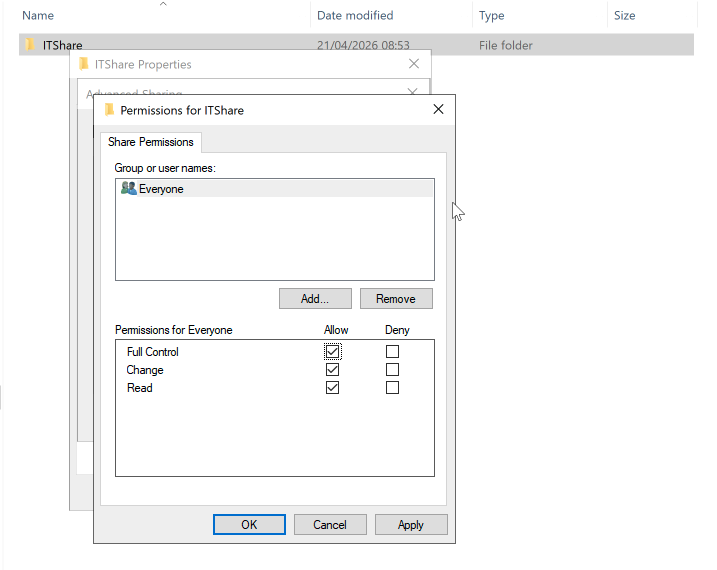
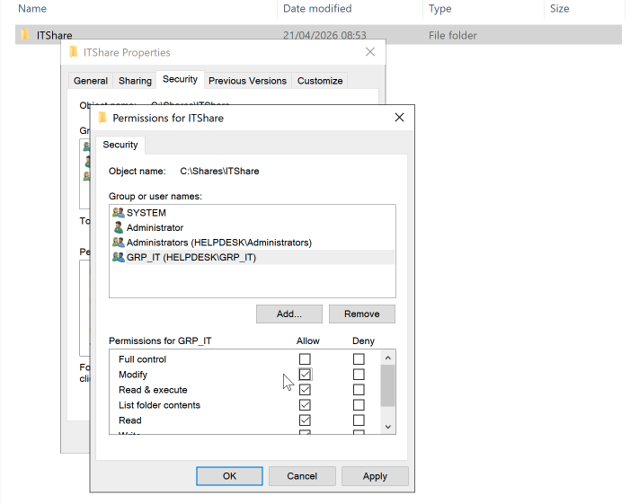
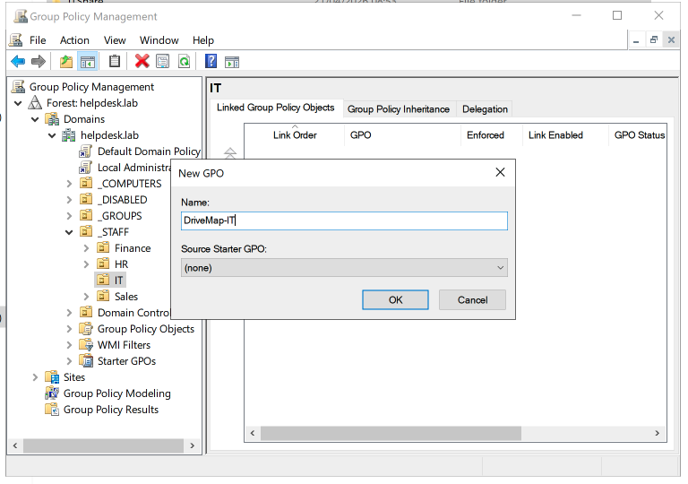
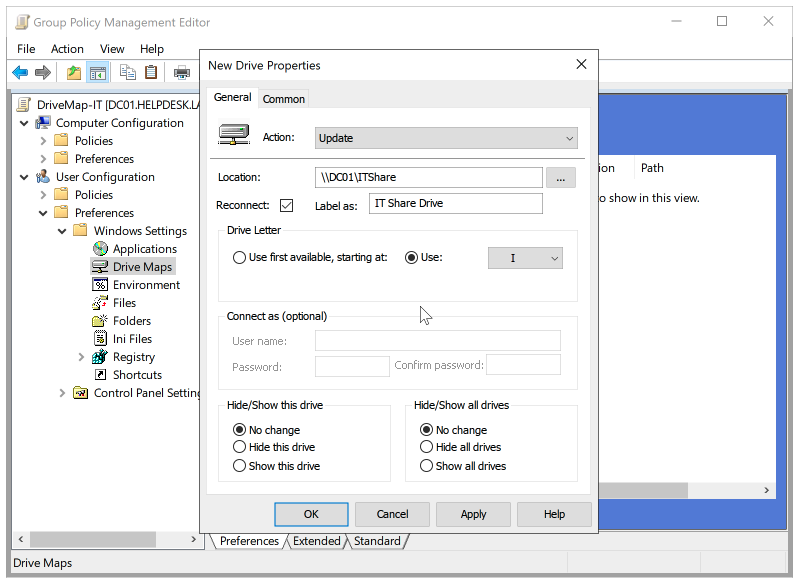
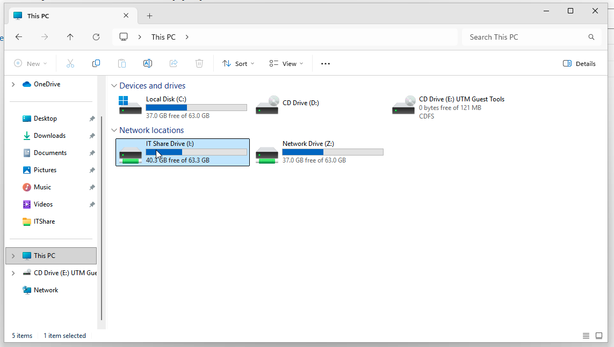

# 🔐 Activity: Group Policy Objects & Network Shares

| Field | Value |
|---|---|
| **Environment** | `helpdesk.lab` — Server 2022 (Host) / Windows 11 (Client) |
| **Tool Used** | Group Policy Management Console (GPMC) / File Explorer |
| **Status** | ✅ Complete |
| **Date** | 24 April 2026 |

---

## Objective
To deploy a secure departmental network file share (`ITShare`) by distinctly configuring Share vs. NTFS permissions, and deploying it automatically to endpoint workstations using Group Policy Objects (GPOs).

---

## ITIL Alignment & The "Why"
GPOs are the backbone of centralised endpoint management, aligning directly with the ITIL 4 **Service Configuration Management** practice. Instead of visiting each machine individually to change a setting, a GPO lets you define a rule once and have it apply automatically to hundreds of devices or users.

Furthermore, this lab demonstrates a foundational understanding of modern Access Control. By setting **Share Permissions** to "Everyone: Full Control", we open the "network front gate" to avoid generic connectivity errors. However, we strictly rely on **NTFS Security Permissions** (the "bedroom locks") tied to our Active Directory Security Group (`GRP_IT`) to truly secure the data. This guarantees zero-trust lateral separation between departments.

---

## Execution: Setup & Investigation

### Step 1: Configuring Share vs. NTFS Permissions
On the Domain Controller (`DC01`), a new folder named `ITShare` was created.

First, the network boundary (Share Permissions) was deliberately opened to `Everyone` to prevent share-level blocking.

Second, real security was enforced at the file-system level. The `Everyone` and `Domain Users` groups were removed. The Active Directory security group `GRP_IT` (created in Activity 01) was added and granted **Modify** rights. This ensures only IT staff have read/write access.

### Step 2: Creating the Automation (GPO)
With the secure folder staged, it needed pushing to end-users automatically to reduce manually mapped drive service desk requests.

Inside **Group Policy Management Console (GPMC)**, a new GPO named `DriveMap-IT` was created and linked explicitly to the `IT` Organizational Unit. Linking to the lower-level OU ensures HR or Sales users never process this specific policy.

The policy was edited under `User Configuration > Preferences > Windows Settings > Drive Maps`. The policy was dynamically configured to map the exact UNC path `\\DC01\ITShare` to the specific `I:` drive letter upon user logon.

### Step 3: Verification on the Client
To prove the enterprise automation worked, a test was performed on the `CLIENT01` endpoint. After running a `gpupdate /force` and restarting the workstation, `jcarter` (who resides in the IT OU and `GRP_IT` security group) logged in.

Without any manual intervention, the network drive natively appeared inside File Explorer as the `I:` drive.

---

## Final Service Request Resolution Report

> **ServiceNow Request:** SR002105  
> **Category:** Infrastructure | **Subcategory:** File Share & Access  
> **Priority:** P4  
>   
> **Resolution Notes:**  
> IT department required a centralized network share for tool storage. Created `\\DC01\ITShare`. Configured Share permissions to Everyone (Full Control) to allow unified routing, and enforced strict NTFS security permissions restricting access exclusively to the `GRP_IT` security group. Engineered a Group Policy Object (`DriveMap-IT`), linked it to the IT OU, and pushed an automated drive mapping targeting the `I:` letter. Verified deployment via virtual endpoint `CLIENT01`; mapping succeeded natively at user logon. Resolving request.

---

## Related
- 🛡️ [Activity: Security Groups](../01-Security-Groups/README.md)
- 👤 [Activity: Delegating Control](../07-Delegation-Least-Privilege/README.md)
