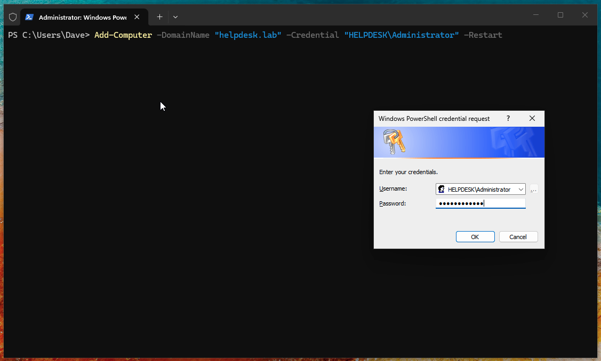
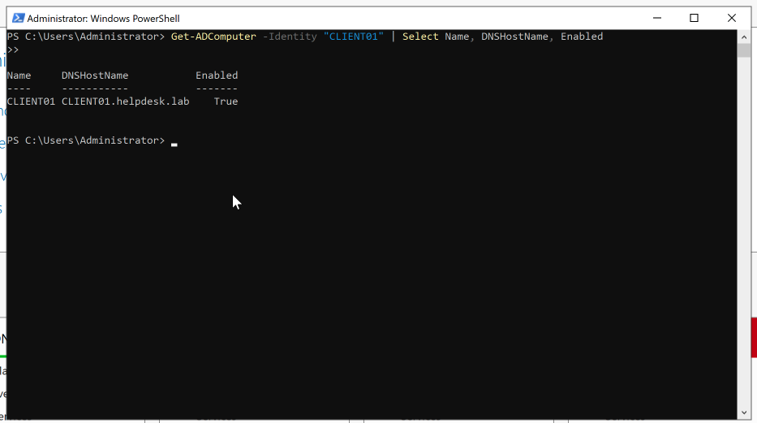
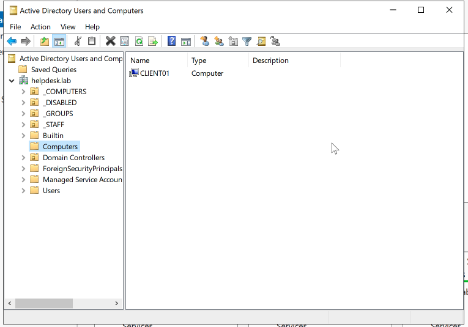
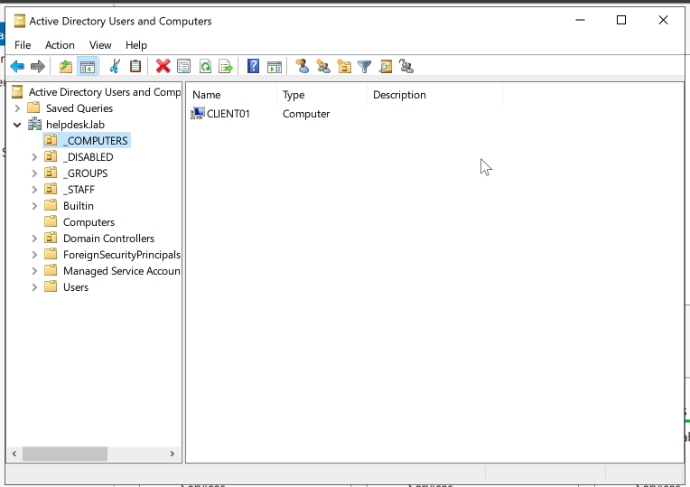
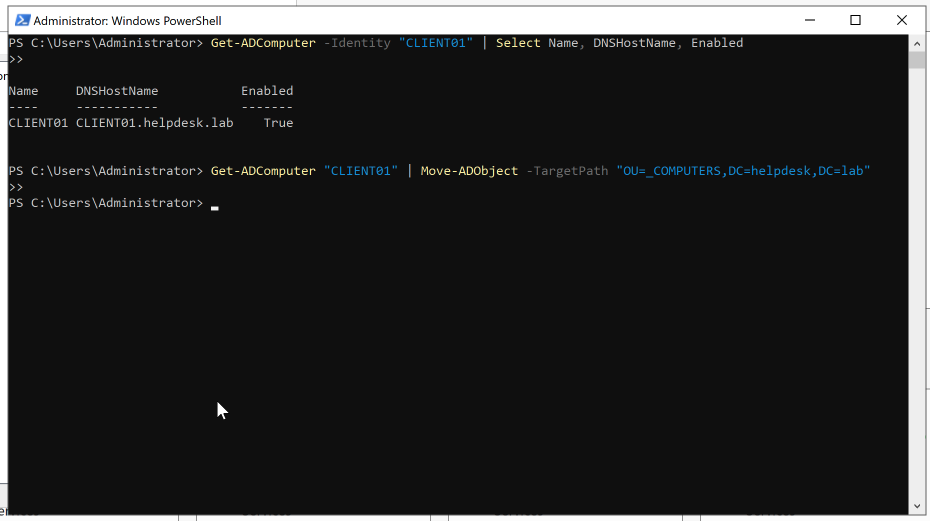
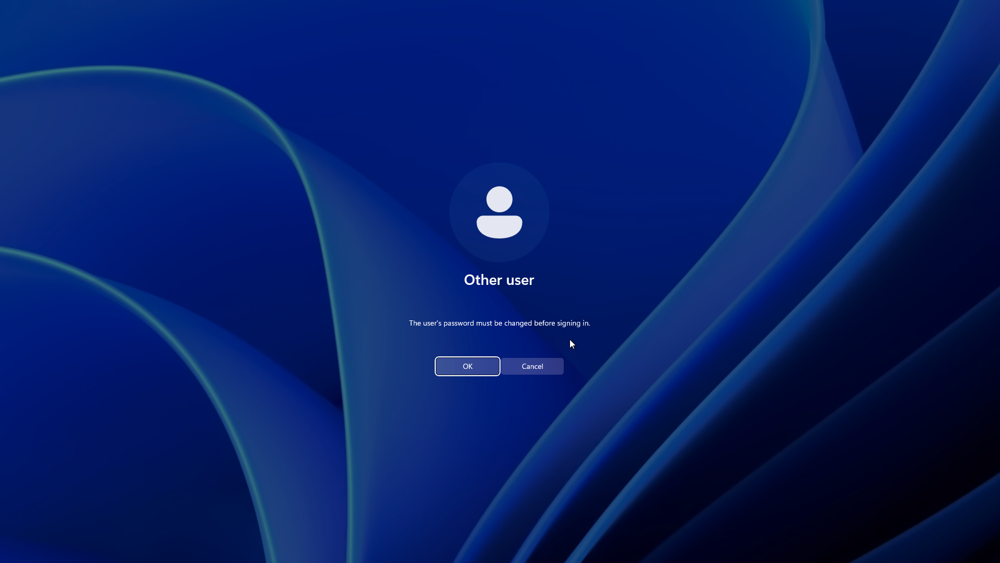
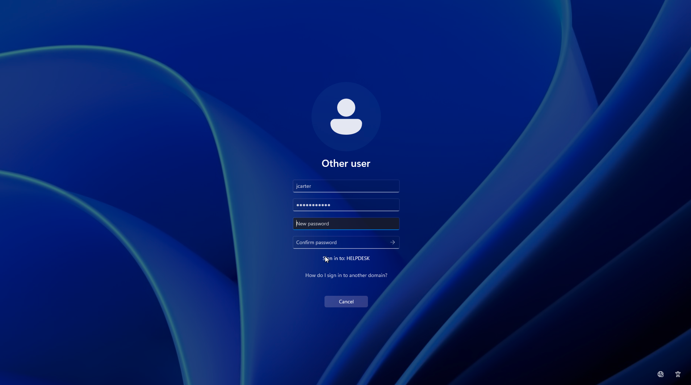

# 🖥️ Activity: Domain Join & Client Provisioning

| Field | Value |
|---|---|
| **Environment** | helpdesk.lab — Windows 11 Client |
| **Tool Used** | System Properties (GUI) / PowerShell |
| **Status** | ✅ Complete |
| **Date** | <!-- Date --> |

---

## Objective
To successfully bind a Windows client machine (`CLIENT01`) to the local Active Directory domain (`helpdesk.lab`), verifying network connectivity, DNS resolution, and ensuring the machine is placed in the correct Organizational Unit (OU) for management.

---

## Prerequisites

Before joining a client to the domain, you must verify:
- [x] DC01 is online and functioning as a Domain Controller and DNS Server.
- [x] CLIENT01 and DC01 are on the same virtual network (e.g., VLAN or Host-Only).
- [x] CLIENT01 has a valid IP address on the domain network (DHCP or static).
- [x] CLIENT01's primary DNS server is set to the Domain Controller's IP (`192.168.100.1`).

---

## ITIL Alignment & The "Why"

Joining a computer to a domain is a critical step in **Release and Deployment Management** as well as **Service Configuration Management**. When a device joins a domain, it transitions from being an unmanaged, standalone node to an official managed Configuration Item (CI) within the organisation's IT infrastructure.

- **Why it matters:** An unmanaged device is a security risk. By joining the domain, the device immediately inherits security baselines (GPOs), centralized authentication (Entra ID / AD), and visibility for the IT Helpdesk.
- **The "Computers" Container:** By default, newly joined machines land in the `CN=Computers` container. IT Support must manually move them (or use staging scripts) to specific OUs (like `OU=Workstations`) so that Group Policies successfully apply.

---

## Execution: Setup & Investigation

The process of joining `CLIENT01` was executed via PowerShell.

### Step 1: DNS Verification
Before attempting to join, we verified the client could successfully resolve the domain name:
```powershell
nslookup helpdesk.lab
ping 192.168.100.1
```

### Step 2: The Domain Join Command
With DNS verified, the machine was bound to the domain using a domain administrator credential:
```powershell
Add-Computer -DomainName "helpdesk.lab" -Credential (Get-Credential) -Restart
```




### Step 3: Moving to the Correct OU
After the reboot, we logged into `DC01` and opened **Active Directory Users and Computers (ADUC)**.
1. Located `CLIENT01` in the default `Computers` container.
   
2. Right-clicked and moved the object into the appropriate management OU (e.g., `OU=_COMPUTERS`).
   
   

### Step 4: First Domain Login — Enforced Password Change

With `CLIENT01` rebooted and domain-joined, we logged in for the first time using the `jcarter` account created during the `02-User-Creation` activity.

Because the `onboard-user.ps1` script sets the **"User must change password at next logon"** flag, Windows enforces a password reset before granting access to the desktop. This is standard security practice — the temporary password (`Welcome123!`) is discarded immediately and replaced by a credential only the user knows.

1. At the login screen, clicked **"Other user"** and entered `jcarter` with the temporary password `Welcome123!`.
2. Windows immediately displayed the mandatory password change prompt:

   

3. After clicking **OK**, the password change screen confirmed the sign-in target as `HELPDESK`, validating the domain join was successful:

   

4. A new password was set and `jcarter` successfully reached the Windows 11 desktop as a domain user.

> **Why this matters:** Forcing a password change at first login is a core security control. It ensures the IT team never retains knowledge of a live user credential — aligning with the principle of least privilege and reducing the risk of credential exposure.

---

## Troubleshooting Encountered

This process was not without its real-world hurdles. During the initial setup, `CLIENT01` could not resolve the domain due to virtualization networking quirks (IPv6 priority and adapter misconfiguration). 

> **See the full Root Cause Analysis and Resolution in the KB:**
> 📋 [KB-008: DNS Domain Join Failure (IPv6 & Routing Conflict)](../../../kb-articles/dns-domain-join-failure.md)

---

## Final Service Request Resolution Report

> **ServiceNow Request:** SR001962  
> **Category:** Hardware | **Subcategory:** Workstation Deployment  
> **Priority:** P3  
>   
> **Resolution Notes:**  
> New workstation deployment required for Service Desk (`CLIENT01`). Deployed Windows 11 host and verified network connectivity. Investigated initial DNS resolution failure and resolved routing conflict (see KB-008). Executed domain join via PowerShell and manually placed Configuration Item (CI) into the correct management OU. Validated success by enforcing password change on first domain login for test user. Resolving request.

---

## Related

- 🔐 [Activity: Group Policy Objects](../03-Group-Policies/README.md)
- 🖥️ [Activity: Deploying Windows Admin Center](../05-Windows-Admin-Center/README.md)
- 📋 [KB-008: DNS Domain Join Failure](../../../kb-articles/dns-domain-join-failure.md)
