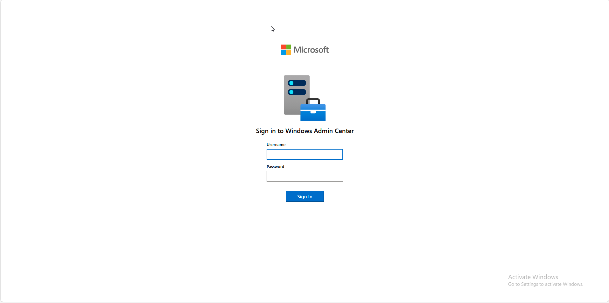
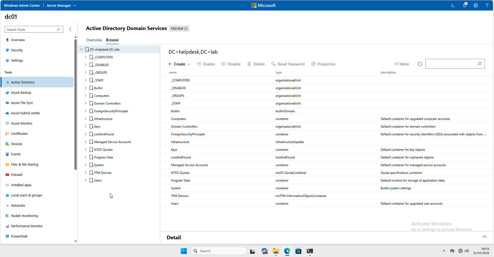
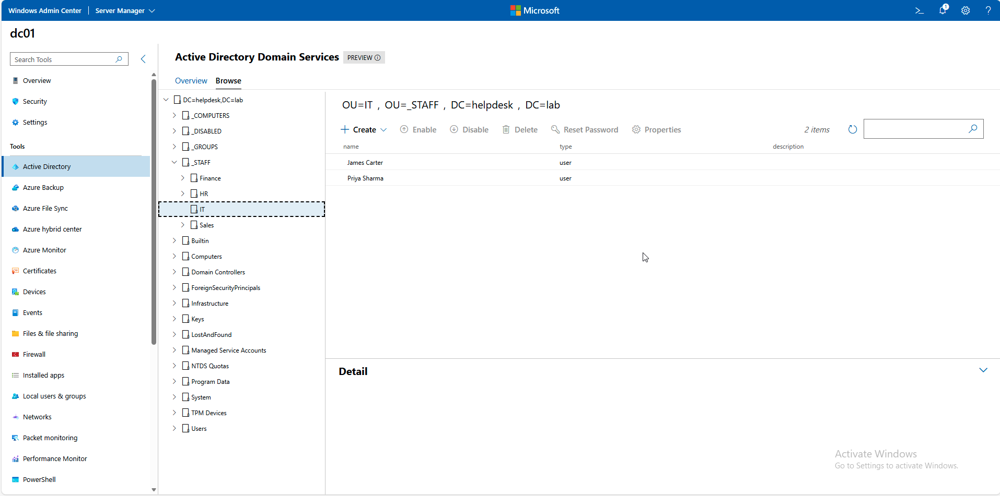
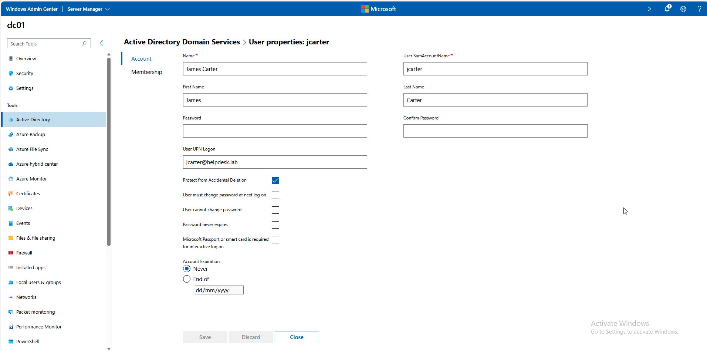
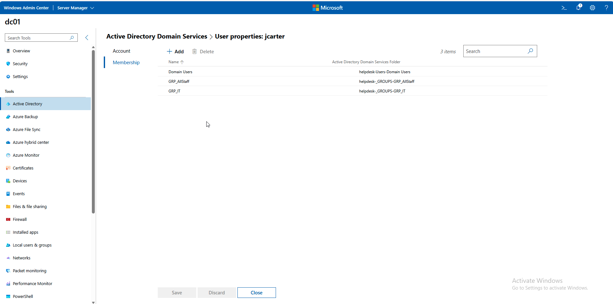

# 🖥️ Activity: Deploying Windows Admin Center for Centralised Domain Management

| Field | Value |
|---|---|
| **Environment** | `helpdesk.lab` — Server 2022 (Host) / Windows 11 (Client) |
| **Tool Used** | Windows Admin Center (WAC) / Browser |
| **Status** | ✅ Complete |
| **Date** | 23 April 2026 |

---

## Objective
To deploy Windows Admin Center (WAC) on the Domain Controller (`DC01`) and access it remotely from the client machine (`CLIENT01`) via a web browser. This provides a single-pane-of-glass interface for managing Active Directory, viewing event logs, managing services, and executing PowerShell commands without needing to RDP into the server.

---

## ITIL Alignment & The "Why"
In an enterprise environment, 1st-line support teams handle high volumes of routine service requests: password resets, account unlocks, and group membership changes. 

RDP access to Domain Controllers is typically restricted for junior engineers due to security risks. Deploying a web-based management tier like Windows Admin Center (WAC) aligns with **Service Desk** best practices by providing a secure, delegated access method to fulfill these standard service requests rapidly and safely.

---

## Execution: Setup & Investigation

### Step 1: WAC Access
Windows Admin Center was installed on `DC01` and configured to run as a gateway server securely.

On `CLIENT01`, we navigated to the WAC gateway URL using the client browser. Upon landing, WAC prompts for domain credentials to authenticate access.

### Step 2: Dashboard Overview
Once authenticated, the WAC dashboard provides immediate visibility into `DC01`. The Active Directory extension was installed to enable centralized IAM management directly from the browser.

From this single overview, a support engineer can access:
- **Active Directory:** User and group management.
- **Event Logs:** Crucial for investigating application crashes or account lockouts (Event ID 4740).
- **Services:** Quick restarts for stuck services like Print Spooler.
- **Certificates & Firewall:** Visibility into common silent failure points.
- **PowerShell:** Web-based terminal for advanced troubleshooting.

### Step 3: Fulfilling a Service Request
To validate the setup, a typical 1st-line service request was performed entirely through the WAC interface: managing a user account (`jcarter`).

**1. Finding the User**
We used the Active Directory extension to search the directory and locate the user account instantly, bypassing complex ADUC OU structures.

**2. Managing Account Properties & Security**
Clicking into the user's properties reveals the core identity controls. From this single pane, a 1st-line engineer can:
- Instantly verify if the account is locked or expired.
- Reset the user's password securely.
- Enforce core security policies by toggling **"User must change password at next log on"**.

**3. Group Membership & Access Control**
We also verified and managed `jcarter`'s access rights. The interface clearly displays that the user belongs to `Domain Users`, `GRP_AllStaff`, and the department-specific `GRP_IT` group. Modifying access is as simple as clicking "Add" or "Remove".

> **Why this matters:** Fulfilling this request via WAC took seconds and required no direct server RDP access. This demonstrates an understanding of modern enterprise support workflows, focusing on reduced Mean Time to Resolution (MTTR) and adherence to the principle of least privilege. Furthermore, having **Event Logs** and **Services** (like the print spooler) accessible in the same browser tab means 90% of daily 1st-line tickets can be resolved without ever logging onto the Domain Controller.

---

## Final Service Request Resolution Report

> **ServiceNow Request:** SR001988  
> **Category:** Software | **Subcategory:** Infrastructure Utility Deployment  
> **Priority:** P3  
>   
> **Resolution Notes:**  
> Deployed Windows Admin Center (WAC) on DC01 to act as a secure management gateway. Verified access from CLIENT01 web browser. Successfully installed the Active Directory module allowing 1st-line Service Desk agents to perform basic IAM tasks (password resets, block checks) without RDP access to the Domain Controller. Tested functionality by viewing properties for `jcarter`. Resolving request.

---

## Related
- 🖥️ [Activity: Domain Join & Client Provisioning](../04-Domain-Join/README.md)
- 🔐 [Activity: User Creation & Automation](../02-User-Creation/README.md)
