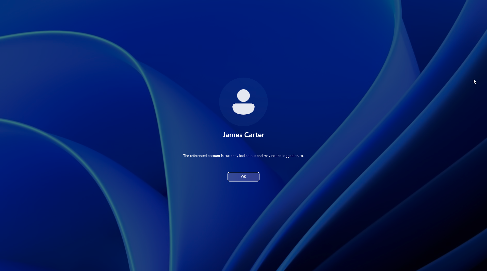
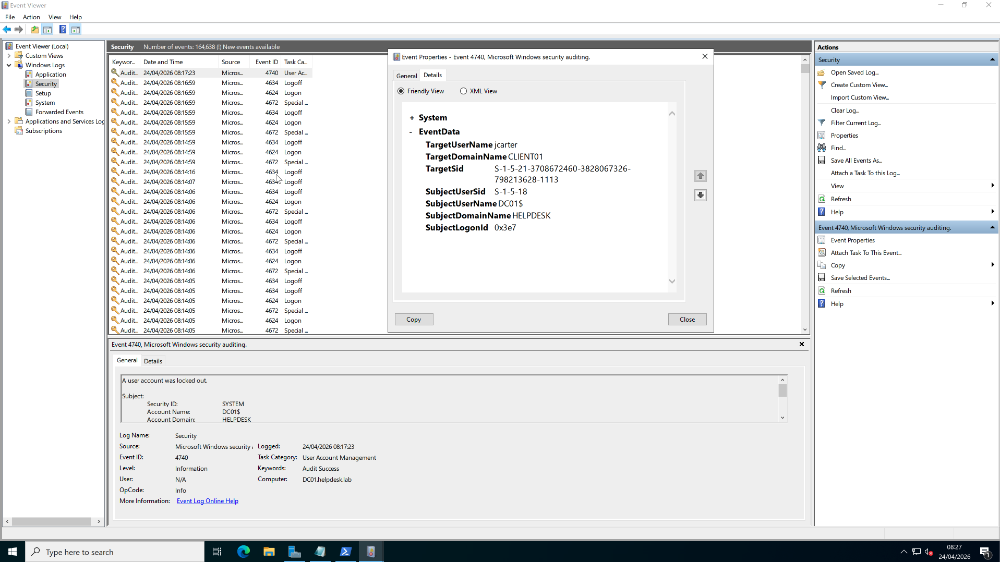
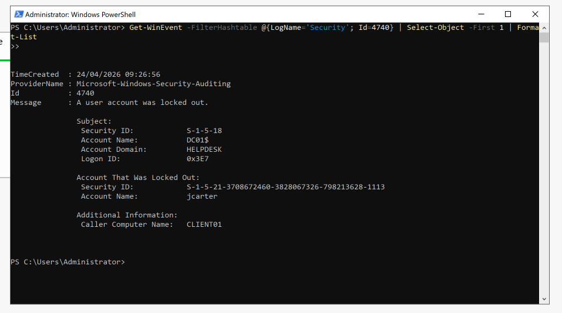

# 🔍 Activity: Diagnosing Account Lockouts & Root Cause Analysis

| Field | Value |
|---|---|
| **Environment** | `helpdesk.lab` — Server 2022 (Host) / Windows 11 (Client) |
| **Tool Used** | Active Directory, PowerShell, Event Viewer |
| **Status** | ✅ Complete |
| **Date** | 24 April 2026 |

---

## Objective
To simulate a user account lockout, investigate the source of the lockout using `Event ID 4740`, and document the incident following ITIL Best Practices for Incident Management. 

---

## The Enterprise Mindset: Why We Don't Just "Unlock"
In enterprise environments, a locked account is incredibly common. The "lazy" approach is to simply right-click the user in Active Directory, click **Unlock**, and close the ticket. 

**Why this is dangerous:**
If an account is continuously locking, it is often caused by a rogue device or background service attempting to authenticate with a stale/expired password. 
- Example: A user changes their password on their laptop, but their mobile phone in their pocket is constantly trying to sync Outlook with the old password.
- If you unlock the account without investigating, the phone will simply attempt to sync again, failing the authentication check, and locking the account again exactly 10 minutes later. 

**The Professional ITIL Procedure:**
1. **Identify:** Confirm the lockout threshold was reached.
2. **Investigate:** Interrogate the Domain Controller to find the exact *Caller Computer Name* that triggered the lockout.
3. **Resolve Root Cause:** Address the rogue device (clear cached credentials, update phone password).
4. **Restore Service:** *Then* unlock the account. 

---

## Execution & Investigation

### Step 1: The Symptom
The environment's Default Domain Policy was updated to enforce a lockout after 5 invalid attempts. On `CLIENT01`, I deliberately typed the wrong password 6 times for the user `jcarter` to trigger the policy.

The OS responded with a clear error preventing further logon attempts:


### Step 2: Investigation via Event Viewer (GUI)
To find the source of the lockout, I logged onto the Domain Controller (`DC01`) and opened **Event Viewer**. 
Navigating to **Windows Logs > Security**, I located the specific Audit Success log assigned to account lockouts: **Event ID 4740**.

Opening this log reveals the `Caller Computer Name`. This is the exact machine on the network that sent the bad password requests.


### Step 3: Investigation via PowerShell (Enterprise Standard)
Trawling through the Event Viewer GUI is slow on a live production server with thousands of logs per minute. To demonstrate efficiency, I executed the same investigation using a pipelined PowerShell command:

```powershell
Get-WinEvent -FilterHashtable @{LogName='Security'; Id=4740} | Select-Object -First 1 | Format-List
```
**Command Breakdown:**
- `Get-WinEvent`: The modern cmdlet to query server logs.
- `-FilterHashtable`: Targets only the `Security` log and explicitly pulls only `Id 4740`, saving massive amounts of RAM.
- `Select-Object -First 1`: Filters the output to only show the single most recent occurrence.
- `Format-List`: Expands the log properties so the custom fields (like `Caller Computer Name`) are visible in the terminal.

The terminal instantly returned `CLIENT01` as the source of the lockout.


---

## Final Incident Resolution Report
With the root cause identified, the account was unlocked using `Unlock-ADAccount -Identity jcarter`. The ticket was documented as follows:

> **ServiceNow Incident:** INC001248  
> **Category:** Account & Access | **Subcategory:** Account Lockout  
> **Priority:** P3  
>   
> **Resolution Notes:**  
> User contacted the Service Desk reporting they were locked out. Found account locked in Active Directory. Investigated Security Logs via DC01 using Event ID 4740. Log output identified `CLIENT01` as the Caller Computer. The user confirmed they had a stale session open on that machine. Cleared cached credentials on `CLIENT01`. Unlocked user account. User verified they could log back in successfully. No further lockouts occurred. Resolving ticket.

---

## Related
- 🖥️ [Activity: Windows Admin Center](../05-Windows-Admin-Center/README.md)
- 🔐 [Activity: User Creation & Automation](../02-User-Creation/README.md)
