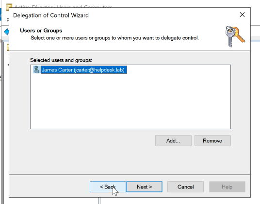
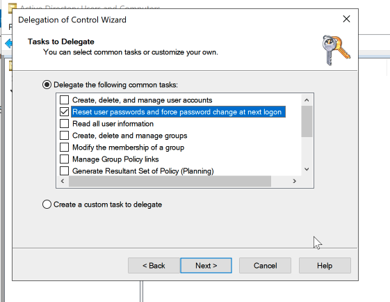
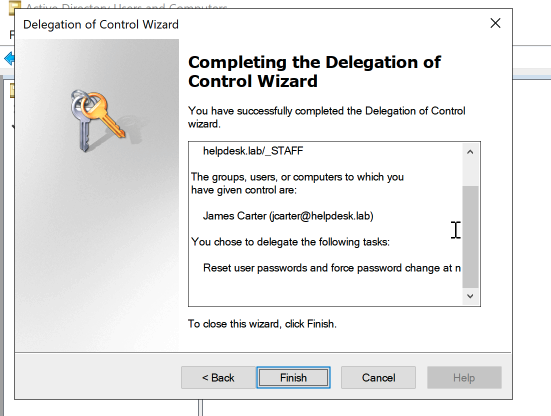
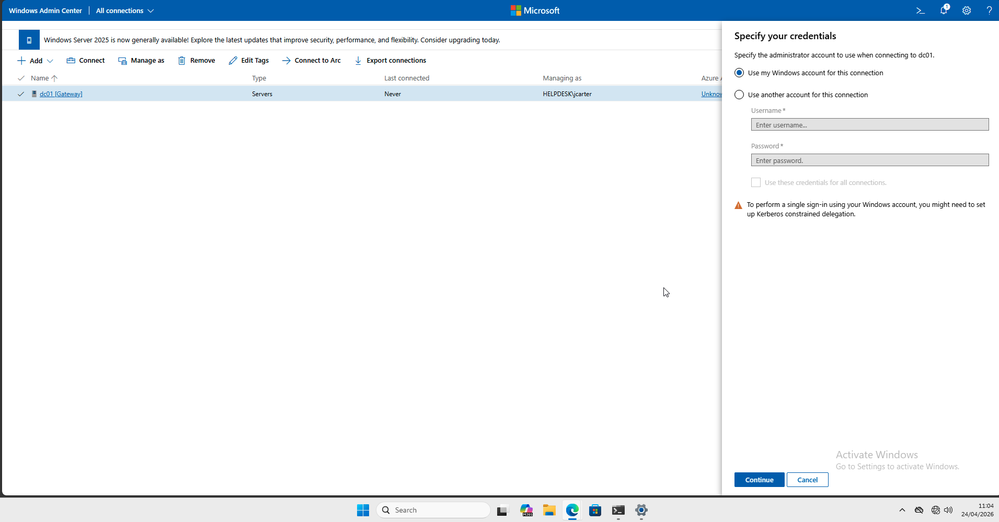
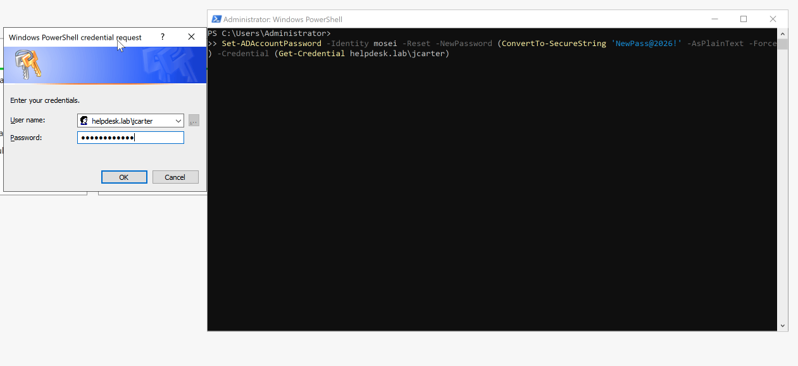
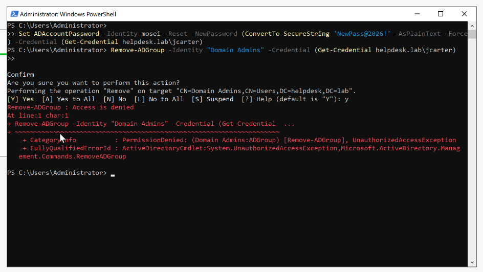

# 🛡️ Activity: Delegating Control & The Principle of Least Privilege

| Field | Value |
|---|---|
| **Environment** | `helpdesk.lab` — Server 2022 (Host) / Windows 11 (Client) |
| **Tool Used** | Active Directory Users and Computers (ADUC) / PowerShell |
| **Status** | ✅ Complete |
| **Date** | 24 April 2026 |

---

## Objective
To empower a 1st-line Service Desk agent (`jcarter`) to reset Active Directory user passwords by modifying the Organizational Unit (OU) Access Control List, strictly avoiding the use of privileged groups like Domain Admins.

---

## ITIL Alignment & The "Why"
In a mature enterprise environment, granting a Junior Support Engineer `Domain Admin` rights so they can reset passwords is a catastrophic security vulnerability. If their workstation is compromised, the ransomware or threat actor instantly gains the keys to the entire Active Directory Forest.

By utilising the **Delegation of Control Wizard**, we adhere to the **Principle of Least Privilege (PoLP)** and a **Zero Trust** mindset. We apply a highly specific "Write" permission (`pwdLastSet`) directly onto the `_STAFF` folder boundary.

This protects the servers from lateral movement while keeping the Service Desk empowered to maintain a low Mean Time to Resolution (MTTR) for daily Service Requests.

---

## Execution: Setup & Investigation

### Step 1: The Delegation Wizard (Applying PoLP)
To build the security boundary, I logged into `DC01` as the Domain Administrator. I opened **Active Directory Users and Computers (ADUC)** and initiated the **Delegate Control** on the top-level `_STAFF` OU. This ensures the permission inherits downwards to all current and future department folders smoothly.

I selected the 1st-line IT agent, `jcarter`, who currently has no administrative privileges (Standard Domain User).


From the common tasks list, I explicitly ticked **only** the box for password resets. No other Directory-level permissions were granted.


Completing the wizard writes the specific Access Control Element (ACE) to the hidden Security tab of the OU. 


---

### Step 2: Verification & The "Deny" Test
A security control is meaningless until it is verified. I proceeded to prove both the **Allow** (operational success) and the **Deny** (security boundary containment).

**1. The Server Restriction**  
Because `jcarter` is merely a Domain User with scoped AD rights, the operating system's *Allow log on locally* policy successfully physically blocked his interactive access to the Domain Controller. 


**2. The Remote PowerShell Test (Allow & Deny)**  
To bypass the console restriction, I utilised Active Directory Web Services to execute the commands remotely using `jcarter`'s credentials. I attempted to reset the password for a standard user (`mosei`).

```powershell
Set-ADAccountPassword -Identity mosei -Reset -NewPassword (ConvertTo-SecureString 'NewPass@2026!' -AsPlainText -Force) -Credential (Get-Credential helpdesk.lab\jcarter)
```


The password command successfully executed and returned silently, proving the Helpdesk agent can fulfill Service Requests interactively or via automation.

Immediately following the success, I deliberately attempted to abuse the identity token by deleting the highly privileged `Domain Admins` group.
```powershell
Remove-ADGroup -Identity "Domain Admins" -Credential (Get-Credential helpdesk.lab\jcarter)
```
Active Directory instantly terminated the request, throwing a fatal **Access Denied** error. This validates the environment is secure.


---

## Final Service Request Resolution Report

> **ServiceNow Request:** SR004921  
> **Category:** Access Management | **Subcategory:** Permission Delegation  
> **Priority:** P3  
>   
> **Resolution Notes:**  
> IT Support Engineer (J. Carter) required permission to perform daily password resets for end-users within the `_STAFF` OU. To maintain compliance with the Principle of Least Privilege, the user was NOT added to Account Operators or Domain Admins. Applied specific Password Reset Access Control List (ACL) via Delegation of Control to the `_STAFF` root OU. Verified J. Carter can successfully reset passwords over ADWS. Demonstrated negative test (Access Denied) when attempting unauthorized administrative group changes. Configuration hardened and validated. Resolving request.

---

## Related
- 🖥️ [Activity: User Creation & Automation](../02-User-Creation/README.md)
- 📝 [Activity: Diagnosing Account Lockouts](../06-Account-Lockouts/README.md)
