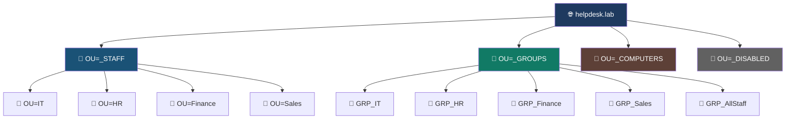
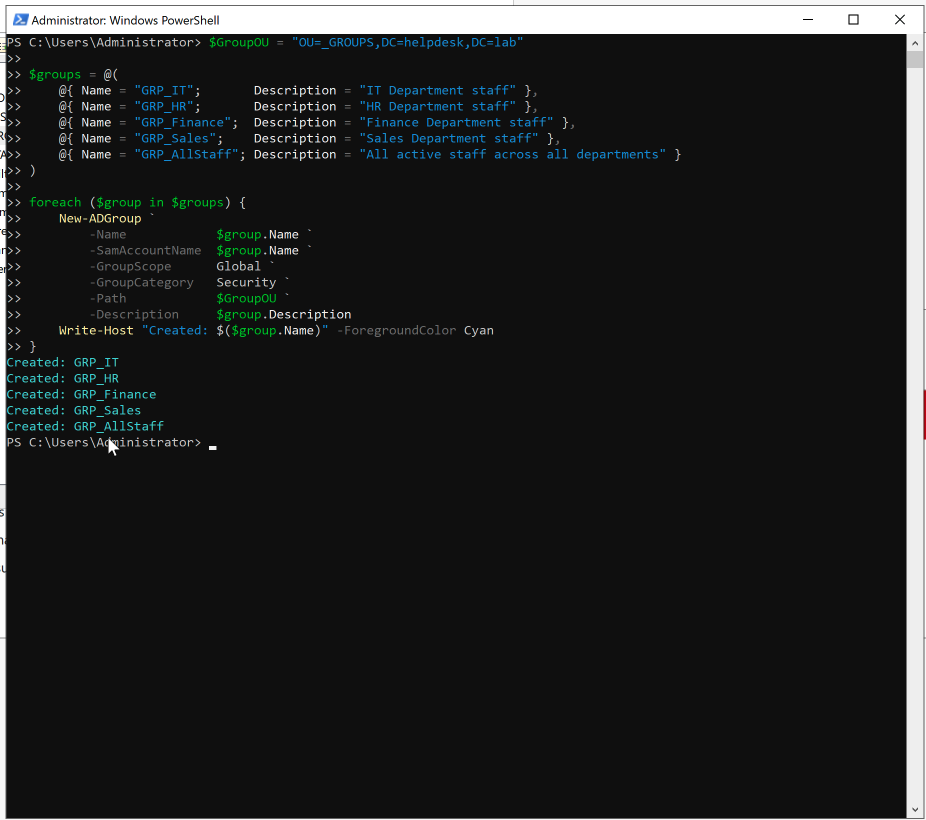
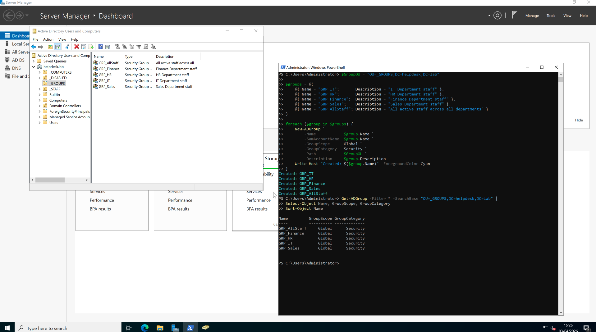
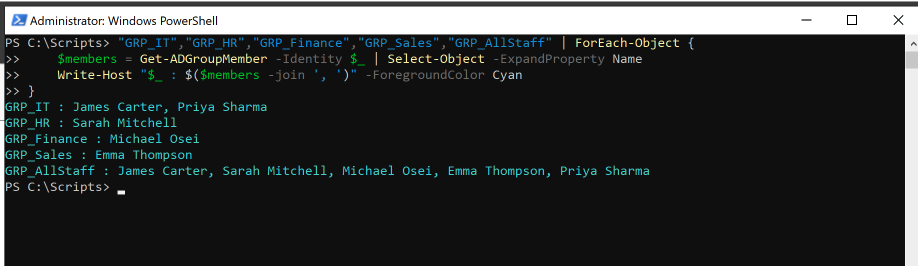

# 🛡️ Activity: Security Groups Configuration

| Field | Value |
|---|---|
| **Environment** | helpdesk.lab — Windows Server 2022 |
| **Tool Used** | PowerShell 5.1 (ActiveDirectory module) |
| **Status** | ✅ Complete |
| **Date** | 2026-04-03 |

---

## Objective
Create organisational security groups across core departments (`IT`, `HR`, `Finance`, `Sales`) as well as the overarching `AllStaff` group to manage role-based access control (RBAC).

---

## Prerequisites

Before running this activity, the following must be in place:

- [ ] AD DS role installed and DC01 promoted to Domain Controller
- [ ] `OU=_GROUPS` Organisational Unit exists in `helpdesk.lab`
- [ ] PowerShell is running **as Administrator** on DC01
- [ ] ActiveDirectory PowerShell module is available (`Import-Module ActiveDirectory`)

---

## ITIL 4 Alignment: Information Security Management

In alignment with the ITIL 4 **Information Security Management** practice, proper RBAC is critical for maintaining the confidentiality, integrity, and availability of enterprise infrastructure.

- **Group Type — Security:** Unlike Distribution groups (used only for email lists), Security groups allow us to control *who has access to what*. Think of them as locks — you put people in a group, and that group gets a key to specific folders, printers, or systems.
- **Group Scope — Global:** We used Global scope because it follows Microsoft's AGDLP best practice. Think of Global groups as job-role buckets: "Everyone in IT goes in this bucket." Later, we can give that entire bucket access to a shared folder in one step, rather than adding individuals one by one.

### AGDLP Flow (How Access Works)


> **Plain English:** This shows the chain of access. A user is placed into a Global Group (their department bucket). That bucket is placed into a Domain Local Group (a specific resource lock). The resource lock gives access to something — like a network share. This layered approach means you only need to move someone between Global Groups when they change department, and all their permissions update automatically.

### Active Directory OU Structure



---

## Step-by-Step Walkthrough

### Step 1: Define the Target Location

```powershell
$GroupOU = "OU=_GROUPS,DC=helpdesk,DC=lab"
```

> **Plain English:** We are telling PowerShell *where* in Active Directory to put the groups. `OU=_GROUPS` is the organisational folder we set aside specifically for security groups, inside our `helpdesk.lab` domain. Think of it as navigating to the right drawer in a filing cabinet before creating a new folder.

---

### Step 2: Define the Groups to Create

```powershell
$groups = @(
    @{ Name = "GRP_IT";       Description = "IT Department staff" },
    @{ Name = "GRP_HR";       Description = "HR Department staff" },
    @{ Name = "GRP_Finance";  Description = "Finance Department staff" },
    @{ Name = "GRP_Sales";    Description = "Sales Department staff" },
    @{ Name = "GRP_AllStaff"; Description = "All active staff across all departments" }
)
```

> **Plain English:** We are building a list of groups we want to create, giving each one a name and a description. Rather than typing out five separate commands, we bundle the information together — this is called an *array* in PowerShell. It is the same idea as writing a shopping list before going to the supermarket.

---

### Step 3: Create Each Group in a Loop

```powershell
foreach ($group in $groups) {
    New-ADGroup `
        -Name             $group.Name `
        -SamAccountName   $group.Name `
        -GroupScope       Global `
        -GroupCategory    Security `
        -Path             $GroupOU `
        -Description      $group.Description
    Write-Host "Created: $($group.Name)" -ForegroundColor Cyan
}
```

> **Plain English:** We are going through our list one item at a time and creating each group in Active Directory. `New-ADGroup` is the command that does the actual creation. Each time one is made successfully, the terminal prints a blue confirmation message. This is identical to going through your shopping list and ticking each item off as you put it in your basket.

**Terminal Output:**
```
Created: GRP_IT
Created: GRP_HR
Created: GRP_Finance
Created: GRP_Sales
Created: GRP_AllStaff
```

---

### Step 4: Verify Groups Were Created

```powershell
Get-ADGroup -Filter * -SearchBase "OU=_GROUPS,DC=helpdesk,DC=lab" |
  Select-Object Name, GroupScope, GroupCategory |
  Sort-Object Name
```

> **Plain English:** We are asking Active Directory to show us everything inside the `_GROUPS` folder, and display only the name, scope, and type columns — sorted alphabetically. This is our quality check to make sure nothing was missed.

**Expected Output:**
```
Name          GroupScope  GroupCategory
----          ----------  -------------
GRP_AllStaff  Global      Security
GRP_Finance   Global      Security
GRP_HR        Global      Security
GRP_IT        Global      Security
GRP_Sales     Global      Security
```

---

## Process Evidence

### 1. Script Creation
Groups were created using a PowerShell loop in the Administrator terminal:





### 2. Terminal Confirmation
Verified group membership after users were onboarded using a member-query loop:

```powershell
"GRP_IT","GRP_HR","GRP_Finance","GRP_Sales","GRP_AllStaff" | ForEach-Object {
    $members = Get-ADGroupMember -Identity $_ | Select-Object -ExpandProperty Name
    Write-Host "$_ : $($members -join ', ')" -ForegroundColor Cyan
}
```

> **Plain English:** We are looping through each group and asking Active Directory to list the members inside it. The result is printed in blue — one line per group, with all member names joined by a comma. This is like taking attendance for each department.

**Output:**
```
GRP_IT      : James Carter, Priya Sharma
GRP_HR      : Sarah Mitchell
GRP_Finance : Michael Osei
GRP_Sales   : Emma Thompson
GRP_AllStaff: James Carter, Sarah Mitchell, Michael Osei, Emma Thompson, Priya Sharma
```



---

## Troubleshooting

| Symptom | Likely Cause | Fix |
|---|---|---|
| `Cannot find an object with identity...` | OU path is wrong | Run `Get-ADOrganizationalUnit -Filter *` to list all OUs |
| `Access is denied` | Not running as Administrator | Right-click PowerShell → **Run as Administrator** |
| Group created but not showing in ADUC | ADUC needs refreshing | Press F5 in ADUC, or run the verification query again |
| `New-ADGroup: The specified group already exists` | Group was already created | Run `Get-ADGroup "GRP_IT"` to confirm — no action needed |

---

## Related

- 👤 [Activity: Batch User Creation](../02-User-Creation/README.md)
- 🔐 [Activity: Group Policy Objects](../03-Group-Policies/README.md)
- 📋 [KB-006: User Onboarding Procedure](../../../kb-articles/onboarding.md)
