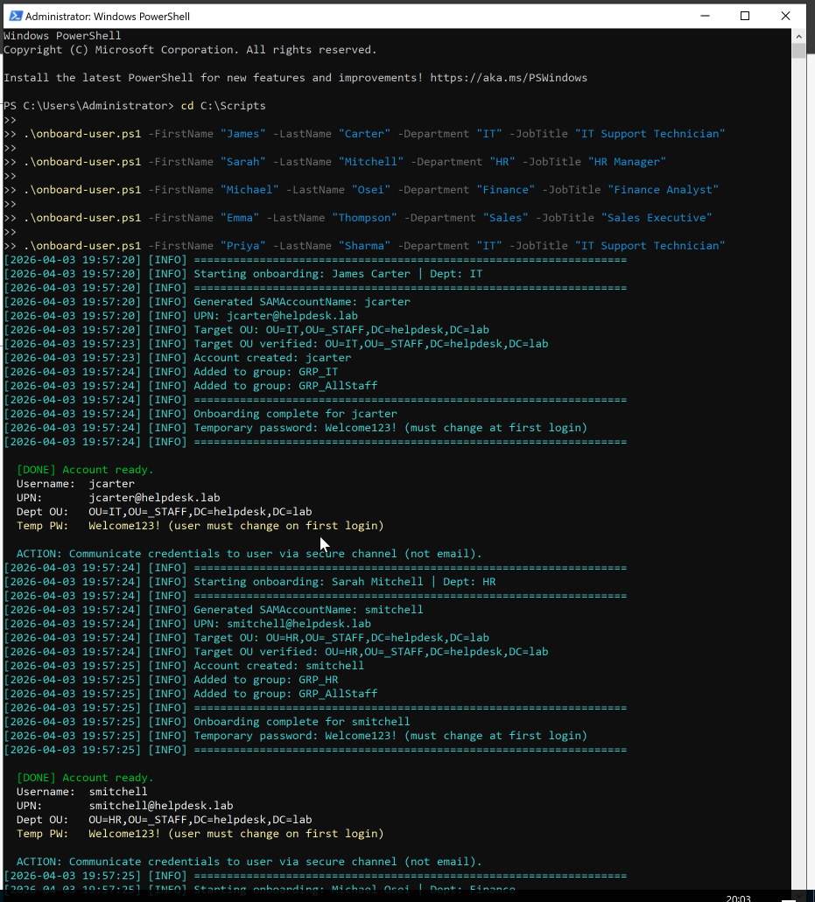
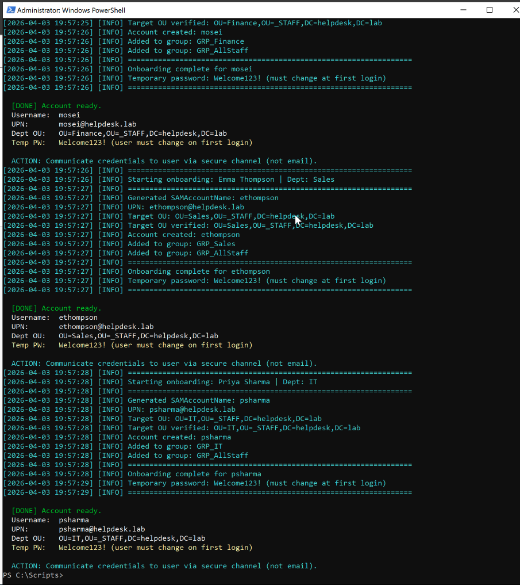
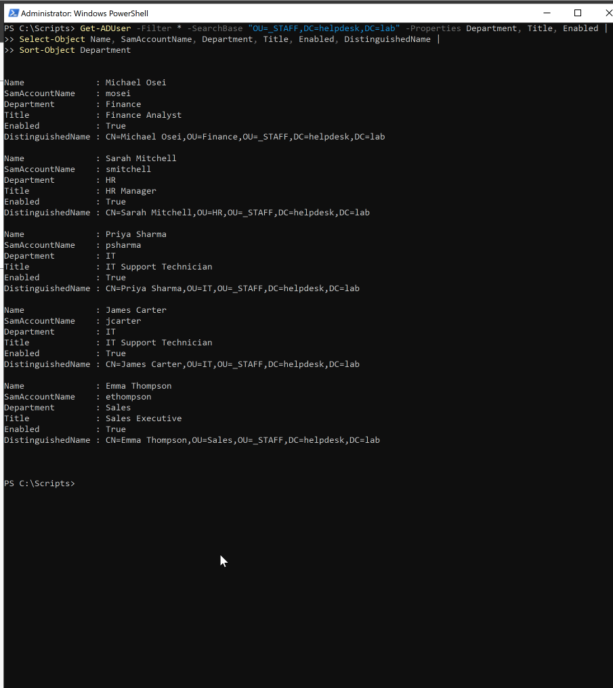

# 👤 Activity: Batch User Creation

## Objective
Use the automated `onboard-user.ps1` script to pre-populate the lab environment with staff accounts across all department OUs, assigning them to the newly created security groups.

## ITIL 4 Alignment: Service Request Management & Standard Changes
User onboarding is one of the most frequent activities handled by a **Service Desk**. By scripting this process, we treat user creation not as an ad-hoc task, but as a **Standard Change**—a pre-authorized, well-documented, and low-risk procedure. 

- **Automation over GUI:** Using PowerShell instead of Active Directory Users and Computers (ADUC) ensures standardization, structured logging, and scalability. It eliminates human error, directly increasing the speed and reliability of fulfilling **Service Requests**.
- **Attribute Value:** Passing specific parameters (`-JobTitle`, `-Department`) populates AD attributes critical for downstream automation (like dynamic Exchange distribution lists or future Entra ID synchronizations).
- **Security Constraint Note:** The script uses a hardcoded string password parameter purely for batch processing speed in this lab environment. In a live enterprise scenario following Zero-Trust principles, we would generate randomized passwords or utilize Temporary Access Passes (TAP) to ensure secure identity handover.

## Process Evidence

### 1. Script Executions
The script successfully populated active directory, displaying structured logging feedback in the console:

```powershell
cd C:\Scripts

.\onboard-user.ps1 -FirstName "James" -LastName "Carter" -Department "IT" -JobTitle "IT Support Technician"

.\onboard-user.ps1 -FirstName "Sarah" -LastName "Mitchell" -Department "HR" -JobTitle "HR Manager"

.\onboard-user.ps1 -FirstName "Michael" -LastName "Osei" -Department "Finance" -JobTitle "Finance Analyst"

.\onboard-user.ps1 -FirstName "Emma" -LastName "Thompson" -Department "Sales" -JobTitle "Sales Executive"

.\onboard-user.ps1 -FirstName "Priya" -LastName "Sharma" -Department "IT" -JobTitle "IT Support Technician"
```

| Script Execution 1 | Script Execution 2 |
| :---: | :---: |
|  |  |

### 2. GUI Confirmation (ADUC)
Verified the accounts were created and placed inside their proper specific department organizational units (OUs):

