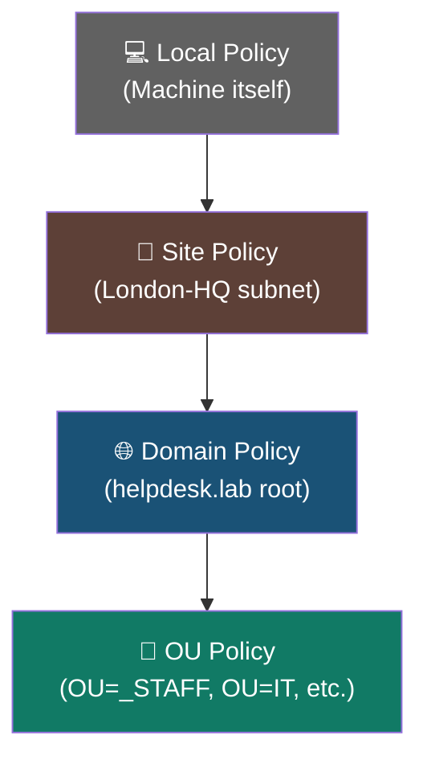
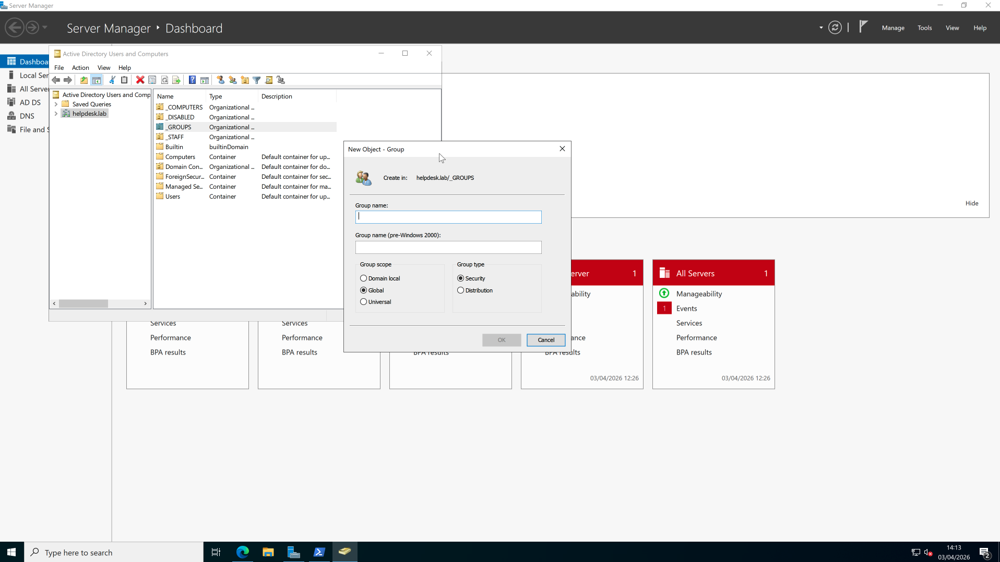

# 🔐 Activity: Group Policy Objects (GPOs)

| Field | Value |
|---|---|
| **Environment** | helpdesk.lab — Windows Server 2022 |
| **Tool Used** | Group Policy Management Console (GPMC) |
| **Status** | 🔄 In Progress |
| **Date** | 2026-04-03 |

---

## Objective
Configure domain-wide Group Policy Objects (GPOs) using the Group Policy Management Console (GPMC) to enforce security settings and push configurations to users and computers automatically.

---

## Prerequisites

Before configuring GPOs, the following must be in place:

- [ ] AD DS role installed and DC01 promoted to Domain Controller
- [ ] OU structure exists — `OU=_STAFF`, `OU=_COMPUTERS`, `OU=_GROUPS`
- [ ] User accounts and groups created (see [Activity: Batch User Creation](../02-User-Creation/README.md))
- [ ] GPMC installed (`Add-WindowsFeature GPMC` or via Server Manager)

---

## ITIL 4 Alignment: Service Configuration Management

GPOs are the backbone of centralised endpoint management, aligning directly with the ITIL 4 **Service Configuration Management** practice. Instead of visiting each machine individually to change a setting, a GPO lets you define a rule once and have it apply automatically to hundreds of devices or users.

- **Why GPOs matter:** Without GPOs, every machine in a domain is configured independently — meaning any technician could accidentally change a setting or install software that violates policy. GPOs enforce a consistent, auditable baseline across all Configuration Items (CIs).
- **LSDOU Processing Order:** GPOs are applied in a specific order — Local → Site → Domain → OU. Understanding this hierarchy prevents policy conflicts. We link GPOs directly to specific OUs (e.g., `OU=_STAFF`) rather than the root domain to avoid accidentally applying restrictive settings to Domain Controllers or service accounts.

> **Plain English:** Think of GPOs like company-wide rules that are automatically enforced the moment a staff member logs in. Instead of emailing everyone "please set your screensaver to lock after 5 minutes," you create one GPO and it happens for everyone, automatically, every time.

### GPO Processing Order (LSDOU)

> **Plain English:** Policies are applied in this exact order — later ones can override earlier ones. A policy set at the OU level is the most specific, so it wins over a conflicting domain-level setting. This is why we target `OU=_STAFF` directly instead of the domain root — it gives us precise, safe control.

---

## Planned GPO Configuration

The following GPOs are planned or in progress for the `helpdesk.lab` domain:

| GPO Name | Linked To | Purpose | Status |
|---|---|---|---|
| Default Domain Password Policy | Domain root | Enforce minimum password length, complexity, and expiry | 🔄 Planned |
| Map Network Drives | `OU=_STAFF` | Automatically map shared drives at login by department | 🔄 Planned |
| Restrict Control Panel | `OU=_STAFF` | Prevent standard users from accessing system settings | 🔄 Planned |

---

## Process Evidence

### GUI Exploration — Group Scope Dialog
During initial setup, the ADUC GUI was explored to understand the difference between Group Scopes (Domain Local, Global, Universal) and Group Types (Security vs Distribution) before switching to PowerShell automation:

> **Note:** This screenshot shows the "New Object – Group" dialog in ADUC. Actual GPO configuration screenshots (via GPMC) will be added here as each policy is built and tested.

---

## Troubleshooting

| Symptom | Likely Cause | Fix |
|---|---|---|
| GPO not applying to users | GPO linked to wrong OU | Open GPMC → confirm the GPO is linked to `OU=_STAFF` not the domain root |
| Setting doesn't take effect after login | Cached policy | Run `gpupdate /force` on the client machine |
| GPO applies to Domain Controllers unintentionally | Linked at domain root | Move the link to the specific OU, or add a WMI filter to exclude DCs |
| GPO appears linked but has no effect | Policy not configured correctly | Run `gpresult /r` on the target machine to see applied policies |

---

## Related

- 🛡️ [Activity: Security Groups](../01-Security-Groups/README.md)
- 👤 [Activity: Batch User Creation](../02-User-Creation/README.md)
- 📋 [KB-006: User Onboarding Procedure](../../../kb-articles/onboarding.md)
