# 🏗️ Active Directory Domain Services (AD-DS)

> Domain controller setup, OU structure, security groups, and AD Sites & Services configuration for the `helpdesk.lab` domain.

[← Back to Home Lab](../README.md)

### AD DS & DNS Role Installation

Installed **Active Directory Domain Services** and **DNS Server** roles on DC01 via Server Manager, then promoted DC01 to domain controller for the new forest `helpdesk.lab`.

**Key configuration decisions:**
- Forest & domain functional level set to **Windows Server 2016** for broad compatibility
- **DNS Server** capability enabled (integrated DNS)
- **Global Catalog** enabled
- DSRM password configured for disaster recovery

<details>
<summary>📸 AD DS role installation — Server Manager</summary>

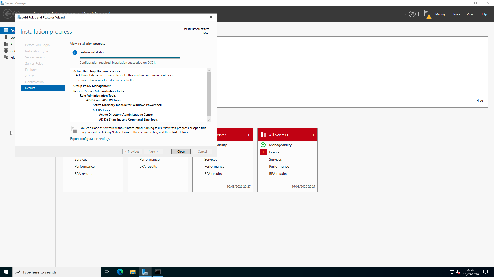

</details>

<details>
<summary>📸 Domain Controller options — configuration wizard</summary>

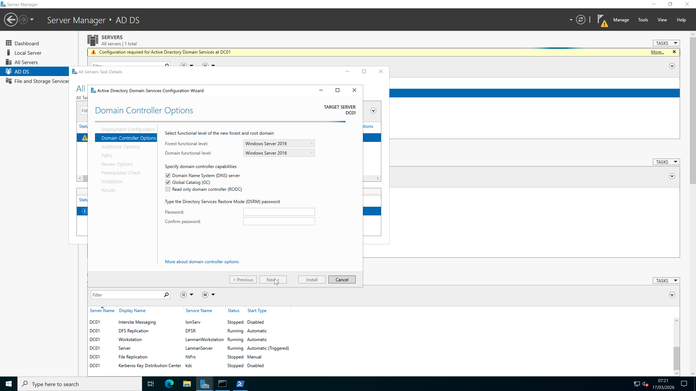

</details>

<details>
<summary>📸 Successful DC promotion — server restarting</summary>

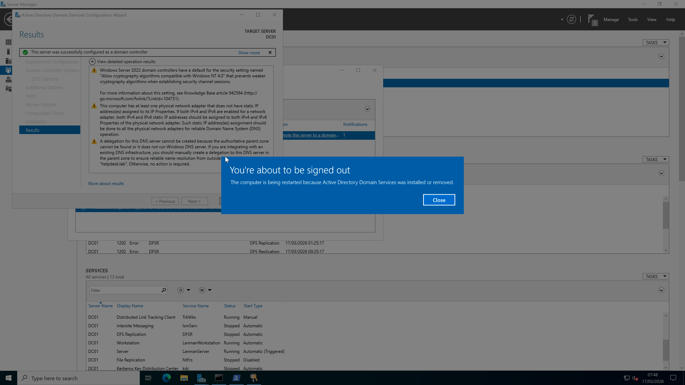

</details>

<details>
<summary>📸 Server Manager dashboard — AD DS & DNS roles active</summary>

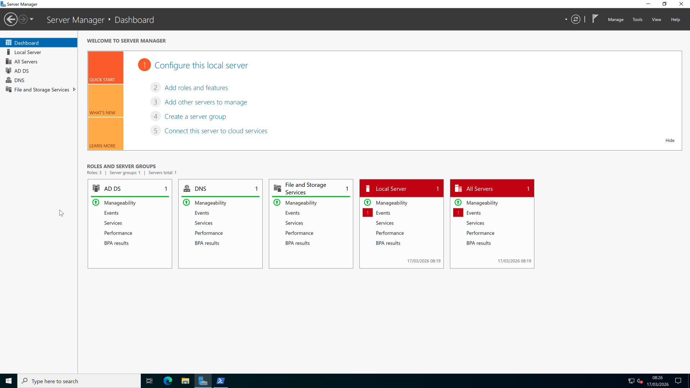

</details>

---

### Domain Verification

Confirmed the domain is operational using PowerShell:

```powershell
# Verify domain details
Get-ADDomain | Select DNSRoot, NetBIOSName, PDCEmulator, DomainMode

# Verify core AD services are running
Get-Service adws, kdc, netlogon, dns | Select Name, Status

# Verify forest configuration
Get-ADForest
```

<details>
<summary>📸 Get-ADDomain output — helpdesk.lab confirmed</summary>

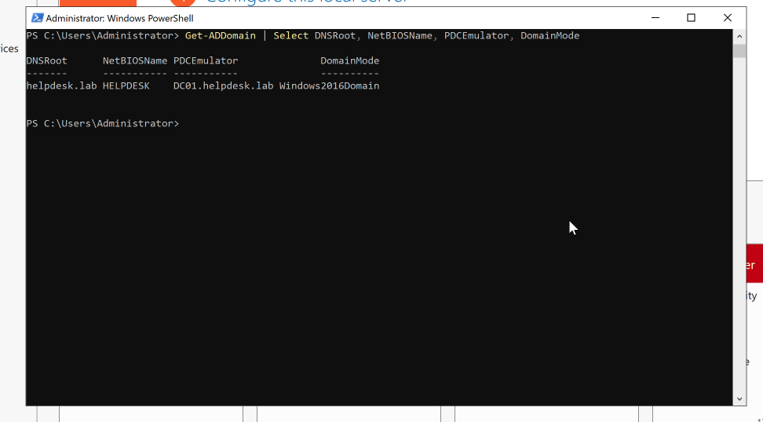

</details>

<details>
<summary>📸 AD services check — all running</summary>

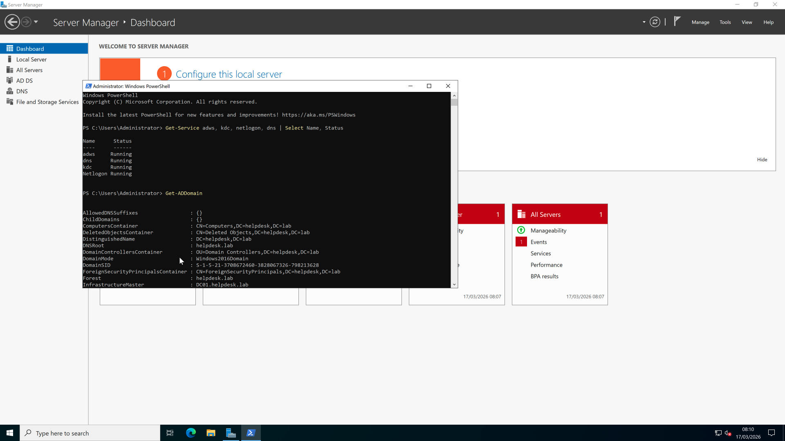

</details>

<details>
<summary>📸 Get-ADForest — forest summary with sites</summary>

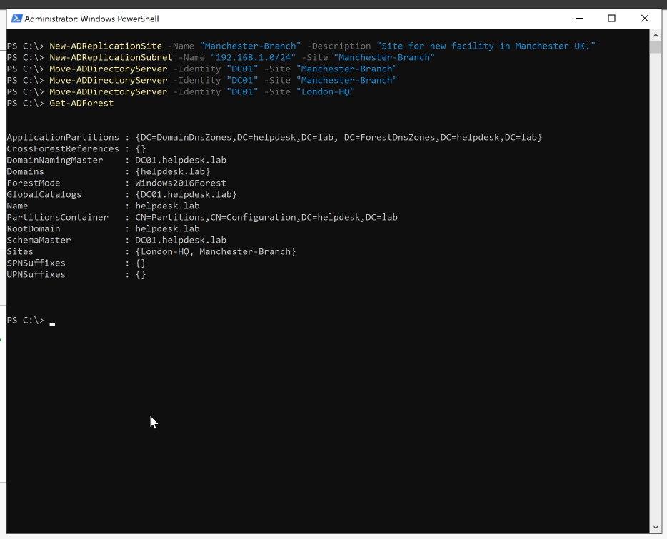

</details>

---

### Organisational Unit (OU) Structure

Designed a clean OU hierarchy to separate staff by department, with dedicated OUs for computers, security groups, and disabled accounts:

```
helpdesk.lab
├── _STAFF
│   ├── IT
│   ├── HR
│   ├── Finance
│   └── Sales
├── _COMPUTERS
├── _GROUPS
├── _DISABLED
├── Domain Controllers
└── (default containers)
```

Created via PowerShell:

```powershell
New-ADOrganizationalUnit -Name "_STAFF"    -Path "DC=helpdesk,DC=lab"
New-ADOrganizationalUnit -Name "IT"        -Path "OU=_STAFF,DC=helpdesk,DC=lab"
New-ADOrganizationalUnit -Name "HR"        -Path "OU=_STAFF,DC=helpdesk,DC=lab"
New-ADOrganizationalUnit -Name "Finance"   -Path "OU=_STAFF,DC=helpdesk,DC=lab"
New-ADOrganizationalUnit -Name "Sales"     -Path "OU=_STAFF,DC=helpdesk,DC=lab"
New-ADOrganizationalUnit -Name "_COMPUTERS" -Path "DC=helpdesk,DC=lab"
New-ADOrganizationalUnit -Name "_GROUPS"    -Path "DC=helpdesk,DC=lab"
New-ADOrganizationalUnit -Name "_DISABLED"  -Path "DC=helpdesk,DC=lab"
```

<details>
<summary>📸 OU creation in PowerShell</summary>

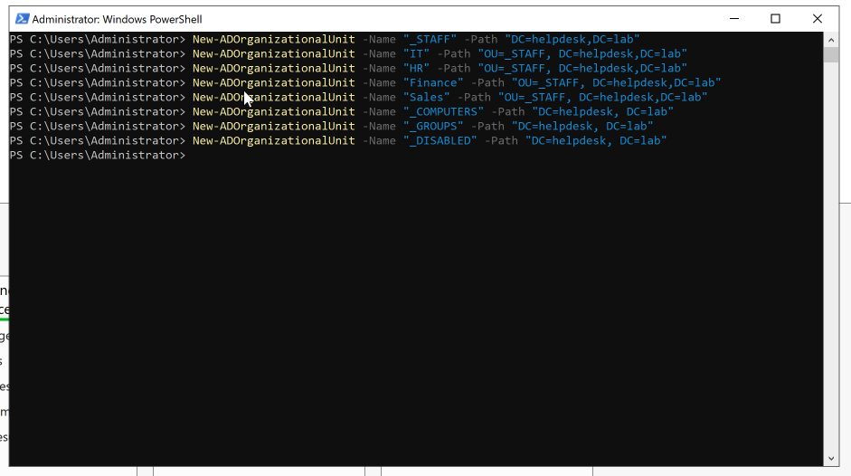

</details>

<details>
<summary>📸 OU structure in Active Directory Users and Computers</summary>

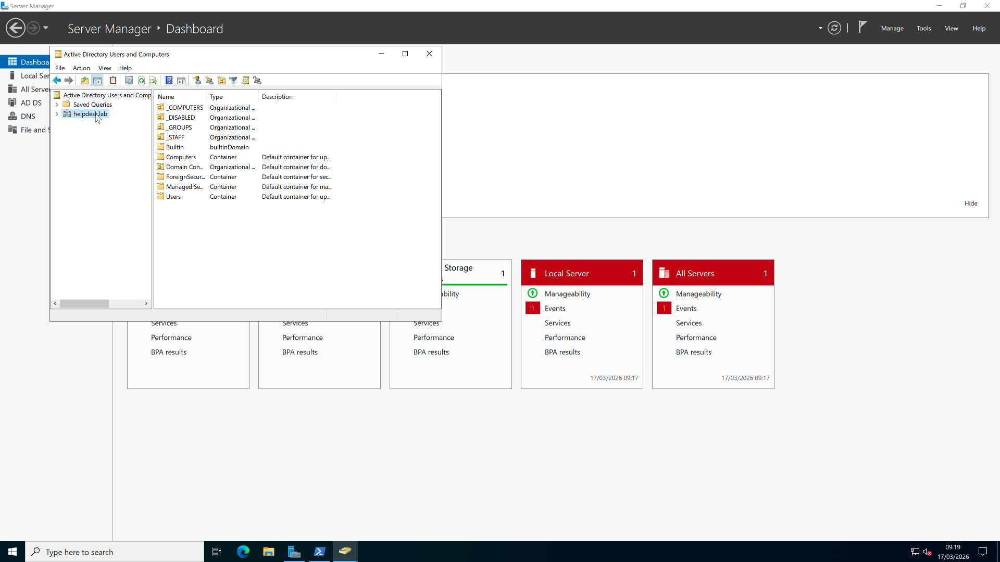

</details>

---

### Security Groups

Created department-based security groups under `_GROUPS` OU for role-based access control:

| Group | Scope | Category | Purpose |
|-------|-------|----------|---------|
| IT-Staff | Global | Security | IT department member access |
| HR-Staff | Global | Security | HR department member access |
| Finance-Staff | Global | Security | Finance department member access |
| Sales-Staff | Global | Security | Sales department member access |
| IT-Admins | Global | Security | Elevated admin privileges for IT |

<details>
<summary>📸 Security groups — PowerShell creation + ADUC view</summary>

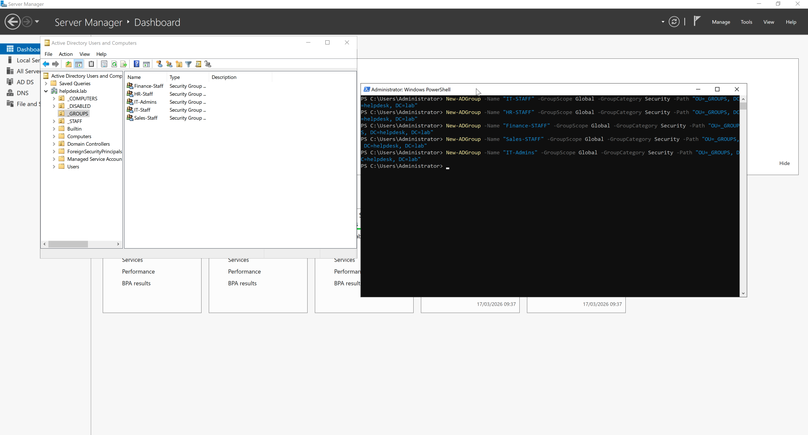

</details>

---

### AD Sites & Services

Configured multi-site topology to simulate a real-world enterprise with a London headquarters and Manchester branch office:

| Site | Subnet | Description |
|------|--------|-------------|
| London-HQ | `192.168.100.0/24` | Primary site — headquarters |
| Manchester-Branch | `192.168.1.0/24` | Branch office |

```powershell
New-ADReplicationSite -Name "Manchester-Branch" -Description "Site for new facility in Manchester UK."
New-ADReplicationSubnet -Name "192.168.1.0/24" -Site "Manchester-Branch"
Move-ADDirectoryServer -Identity "DC01" -Site "London-HQ"
```

<details>
<summary>📸 Site and subnet creation</summary>

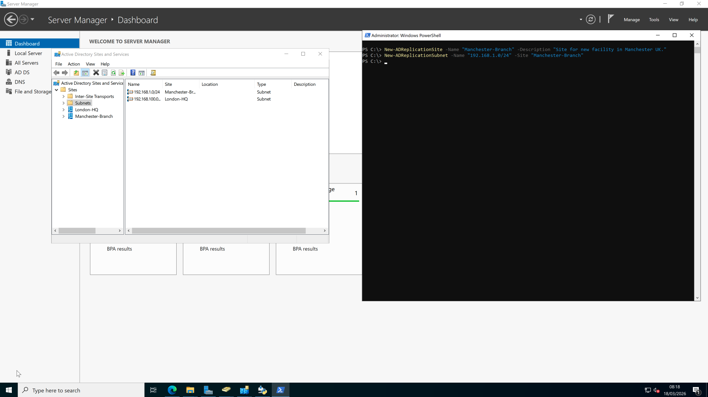

</details>

<details>
<summary>📸 AD Sites and Services — DC01 in Manchester-Branch</summary>

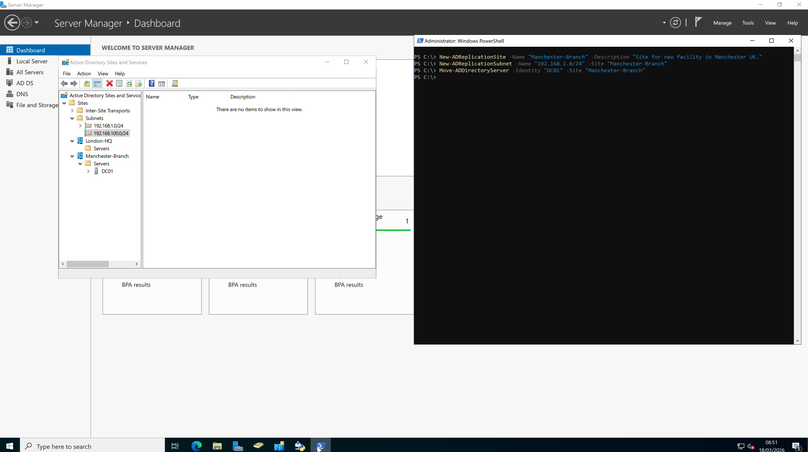

</details>

---

*Last updated: 20 March 2026*
