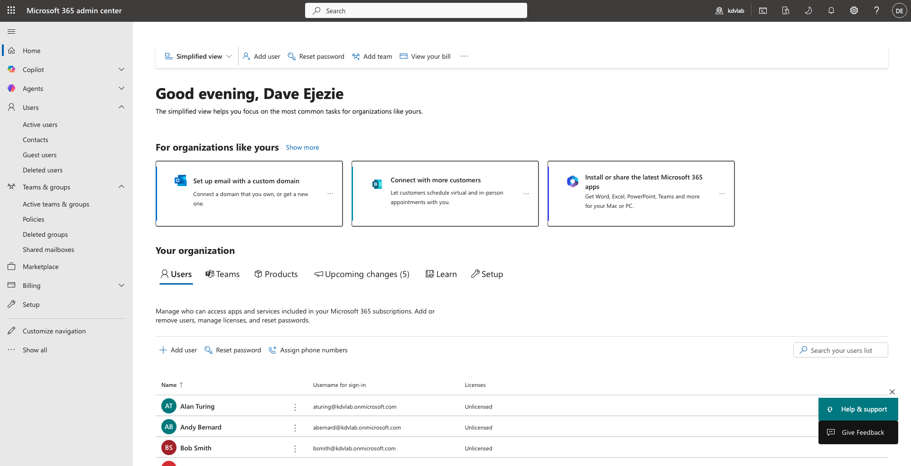
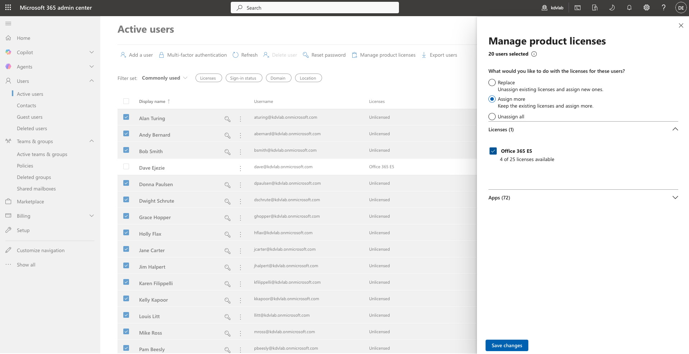

# Lab 2.1: M365 Admin Centre Fundamentals & Tenant Setup

To begin our Cloud Administration phase, we first need a Microsoft 365 Tenant. A "tenant" is your organisation's dedicated slice of Microsoft 365 cloud services. 

For lab environments, the **Microsoft 365 Developer Program** is the gold standard because it provides a free, renewable E5 licence (the highest tier) that includes Entra ID P2, Exchange Online, Teams, and dummy data. 

> **Note:** Microsoft occasionally restricts new sign-ups to the Developer Program. If you are unable to join, you can alternatively sign up for a **free 30-day trial of Microsoft 365 Business Premium** directly from the Microsoft website.

---

## 🛠️ Task 1: Provisioning the M365 Tenant

### Option A: Microsoft 365 Developer Program (Recommended)
1. Go to the [Microsoft 365 Developer Program website](https://developer.microsoft.com/en-us/microsoft-365/dev-program).
2. Click **Join Now** and sign in with a personal Microsoft account (e.g., Outlook, Hotmail).
3. Fill out the profile details (Country, Company name can be "Helpdesk Lab", etc.).
4. When prompted, choose to set up an **Instant Sandbox** (this pre-provisions dummy users and emails, which is great for our lab).
5. Choose an admin username (e.g., `admin`) and a password.
6. Note down your new administrator email. It will look something like `admin@yourdomain.onmicrosoft.com`.

### Option B: M365 Business Premium Trial (Fallback)
If the Developer Program blocks you:
1. Search for "Microsoft 365 Business Premium Trial" and click the official Microsoft link.
2. Click **Try free for one month**.
3. Follow the prompts to create an account. You will need to provide an email and create a new `.onmicrosoft.com` domain.
4. You may be asked for a credit card, but it will not be charged if you cancel before 30 days.

---

## 🛠️ Task 2: First Logon and Navigating the Portals

Once your tenant is provisioned, you are the **Global Administrator**.

1. Open an Incognito/Private browsing window (to avoid conflict with your personal accounts).
2. Navigate to [admin.microsoft.com](https://admin.microsoft.com).
3. Log in with your `admin@...onmicrosoft.com` credentials.
4. If prompted to set up MFA (Microsoft Authenticator), proceed to secure your admin account.
5. Take a look around the **Microsoft 365 admin center**. 
   - Expand the **Users** menu -> **Active users** (this is where we will manage licenses).
   - In the left menu, click **Show all** to see the list of admin centers at the bottom.
6. Click on **Identity** (or Entra) to open the [Microsoft Entra admin center](https://entra.microsoft.com). 
   - *Note: Entra ID is the new name for Azure Active Directory (Azure AD). This is the cloud equivalent of your DC01.*

> **Proof of Execution:**
> Below is the main dashboard of the newly provisioned Microsoft 365 Admin Center.
> 
> 

---

## 🛠️ Task 3: Bulk License Assignment

When users are synced from an on-premises Active Directory via Entra Connect, they are created in the cloud without any licenses. In a Helpdesk role, one of the most common tasks is assigning the correct licenses to new hires so they can access Exchange (Email), Teams, and SharePoint.

1. Navigate to **Users** -> **Active users**.
2. Select multiple users using the checkboxes next to their names.
3. Click **Manage product licenses** in the top menu.
4. Choose **Assign more: Keep the existing licenses and assign more**.
5. Select the **Microsoft 365 E5 Developer** license and click **Save changes**.

> **Proof of Execution:**
> Below is proof of successful bulk license assignment to the synced on-premises users.
> 
> 

---

## 📝 Activity Verification

You have successfully navigated the M365 portals and proven competency in bulk manual license assignment.

**Next up:** We will configure **Entra Connect** on your virtual environment to sync your local `helpdesk.lab` users into this new cloud tenant!
