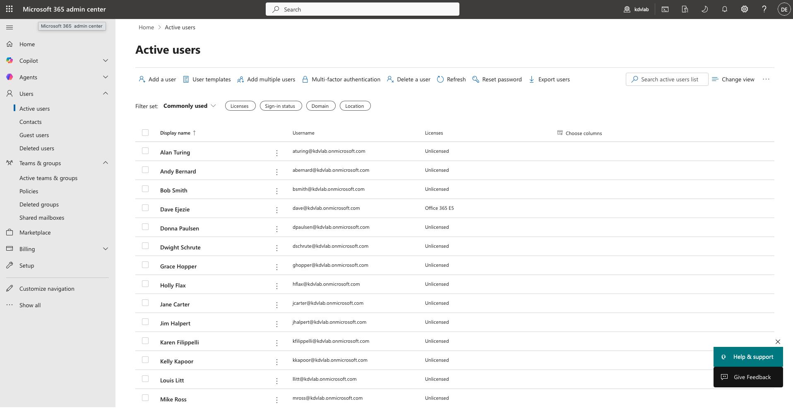

# 🔍 Activity: Lab 2.2 — Hybrid Identity Sync (Entra Connect)

| Field | Value |
|---|---|
| **Environment** | `helpdesk.lab` (On-Prem) + `kdvlab.onmicrosoft.com` (Cloud) |
| **Tool Used** | Microsoft Entra Connect (formerly Azure AD Connect) |
| **Status** | ✅ Completed |
| **Date** | 06 May 2026 |

---

## Objective
Deploy Microsoft Entra Connect on the on-premises Domain Controller (`DC01`) to synchronise the local Active Directory (`helpdesk.lab`) with the newly provisioned Microsoft 365 cloud tenant, establishing a Hybrid Identity environment.

---

## ITIL Alignment & The "Why"
In modern enterprise environments, managing separate usernames and passwords for local computers and cloud applications (like Outlook or Teams) leads to high volumes of password reset tickets and security risks. 

By implementing **Hybrid Identity** via Entra Connect, we ensure a "Single Identity" for users. From an ITIL perspective, this drastically reduces the Service Desk ticket volume (MTTR goes down because password resets sync automatically) and provides a unified point of access control, adhering to robust Identity and Access Management (IAM) standards.

---

## Execution: Setup & Synchronisation

To perform this lab, you will need to start your `DC01` virtual machine.

### Step 1: Download Microsoft Entra Connect
1. Log in to your `DC01` server as the `Administrator` (Domain Admin).
2. Open Microsoft Edge (or use your host machine and transfer the file).
3. Download **[Microsoft Entra Connect](https://www.microsoft.com/en-us/download/details.aspx?id=47594)**.

### Step 2: Run the Installation Wizard
1. Run the downloaded `.msi` file on `DC01`.
2. Agree to the license terms and click **Continue**.
3. Choose **Use express settings**. *(Express settings automatically configure Password Hash Synchronisation, which is what we want so users can log in to M365 with their local passwords).*

### Step 3: Connect the Environments
1. **Connect to Microsoft Entra ID**: Enter the Global Administrator credentials you just created for your new M365 tenant (e.g., `admin@kdvlab.onmicrosoft.com`).
2. **Connect to AD DS**: Enter your local Enterprise Admin credentials (e.g., `helpdesk\Administrator` and your server password).
3. **M365 Sign-In Page**: Because `helpdesk.lab` is a non-routable domain (it's not a real `.com` domain on the internet), Entra Connect will warn you that users will have to use the `.onmicrosoft.com` domain to log in. Check the box to **"Continue without matching all UPN suffixes to verified domains"** and click Next.

### Step 4: Initial Synchronisation
1. On the "Ready to configure" screen, ensure **Start the synchronization process when configuration completes** is checked.
2. Click **Install**.
3. Wait for the configuration to finish and the initial sync to trigger.

---

## Step 5: Verification & Testing

To prove the sync was successful, we need to verify the users appeared in the cloud.

1. Go back to your browser (Incognito) and navigate to the **[Microsoft 365 Admin Center](https://admin.microsoft.com)**.
2. Navigate to **Users** -> **Active users**.
3. Look for your local Active Directory users (e.g., `jcarter`, `bsmith`).
4. Under the "Sync status" column, you should see an icon indicating they are **"Synced from on-premises"** rather than "In cloud".

> **Proof of Execution:**
> Below is the Active Users list confirming that the local Active Directory accounts have been successfully synced to the cloud via Entra Connect. The 'Synced from on-premises' icon confirms the Hybrid Identity trust is functioning.
> 
> 

---

## Related
- 🖥️ [Lab 2.1 - M365 Admin Centre Fundamentals](../01-M365-Admin-Centre/README.md)
