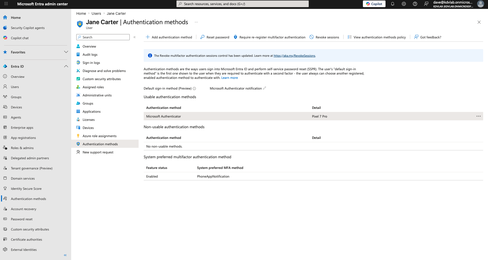
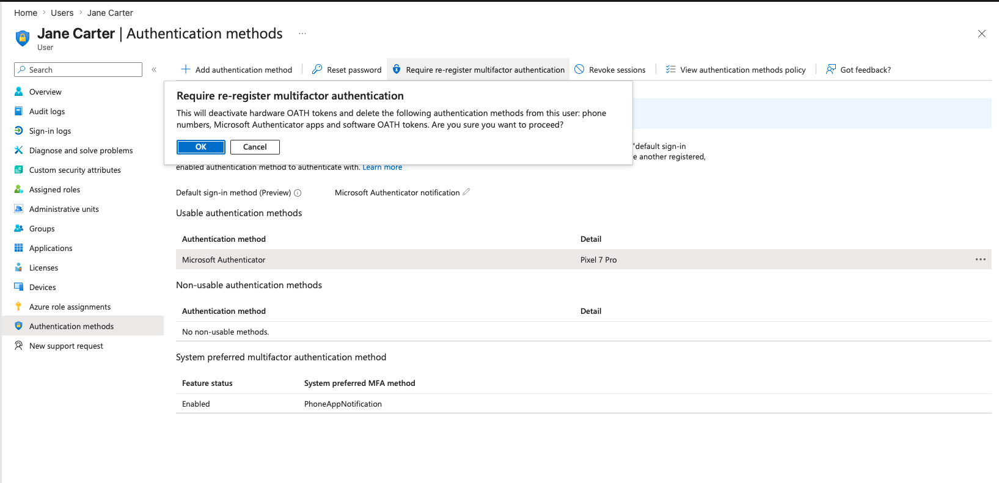
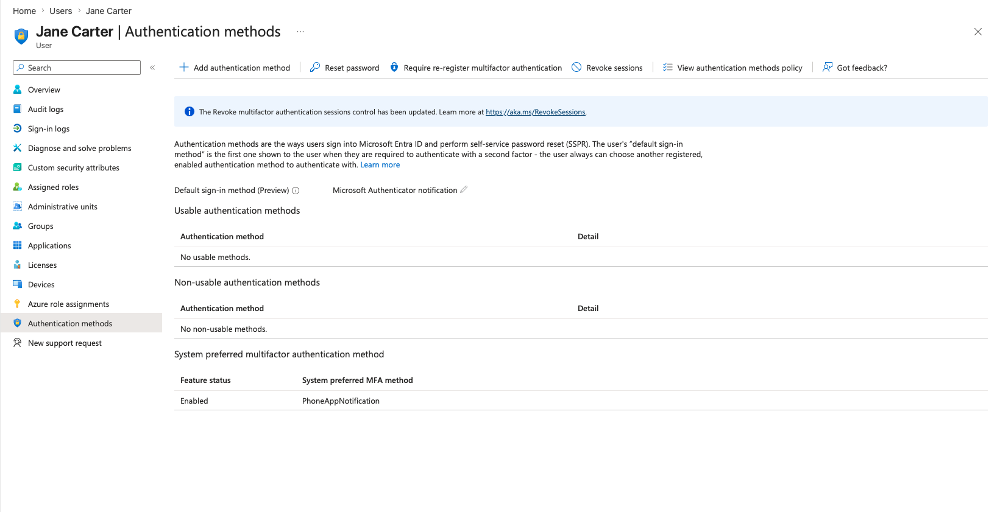

# 🔍 Activity: Lab 2.3 — MFA Reset (The "Lost Phone" Scenario)

| Field | Value |
|---|---|
| **Environment** | Microsoft Entra Admin Center |
| **Ticket Type** | Incident (P3 - Standard) |
| **Status** | ✅ Complete |
| **Date** | 10 May 2026 |

---

## The Scenario
Jane Carter (IT System Admin) lost her iPhone over the weekend and bought a new one. She is trying to log into Microsoft 365 on her laptop, but the system is sending an MFA push notification to her old phone. She is completely locked out of her account.

## ITIL Alignment & The "Why"
In a corporate environment, Multi-Factor Authentication (MFA) is strictly enforced. When users lose or replace their devices, they cannot simply bypass MFA. A Helpdesk Analyst must securely verify the user's identity (usually via a phone call to their manager or checking their employee ID) and then revoke their existing MFA sessions so they can register their new device.

This is a **high-security incident**. If you reset MFA for a hacker who is calling the Helpdesk pretending to be Jane, you have just compromised the entire network.

---

## Execution 1: The Hybrid Identity "Gotcha" (Password Reset)

Before Jane could even reach the MFA prompt, we encountered a classic Hybrid Identity block. 
Because Jane was created via our automated on-premises PowerShell script, her account was flagged with **"User must change password at next logon"**.

Entra ID (the cloud) sees this flag and blocks the login. However, because we are using standard Entra Connect sync without **Password Writeback** enabled, the cloud cannot securely send a new password back down to our local server. 

**The Fix:**
1. Jane must log into a local, domain-joined machine (`CLIENT01`).
2. Windows forces the password change locally.
3. Entra Connect syncs the *new*, permanent password up to the cloud within 2-5 minutes.
4. Jane is then able to log into `portal.office.com`.

*Note: Jane also required a **Microsoft 365 E5 Developer** license assigned in the M365 Admin Center before she could see any applications like Outlook or Teams.*

---

## Execution 2: Registering & Revoking the MFA Session

Once the password synced, Jane logged in and was prompted with *"More information required"* by Microsoft's Security Defaults. She registered her (simulated) Google Pixel 7 Pro using the Microsoft Authenticator app.

To simulate the "Lost Phone" ticket, the Admin must now revoke this device.

1. Open the **[Microsoft Entra Admin Center](https://entra.microsoft.com)** as an Administrator.
2. Navigate to **Identity** -> **Users** -> **All users** -> **Jane Carter**.
3. Open the **Authentication methods** blade.

> **Proof of Execution 1:** Jane's registered Authenticator app on her Pixel 7 Pro.
> 
> 

4. Click the **Require re-register MFA** button at the top of the screen.

> **Proof of Execution 2:** The Admin confirmation pop-up. Clicking this severs the trust with Jane's lost device.
> 
> 

5. The old authentication method is wiped. The very next time Jane tries to log in, she will be forced to scan a brand new QR code with her *new* phone.

> **Proof of Execution 3:** The authentication method is successfully removed.
> 
> 

---

## Related
- 🖥️ [Lab 2.1 - M365 Admin Centre Fundamentals](../01-M365-Admin-Centre/README.md)
