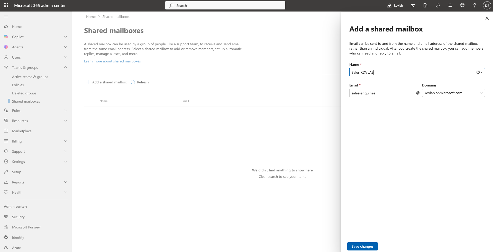
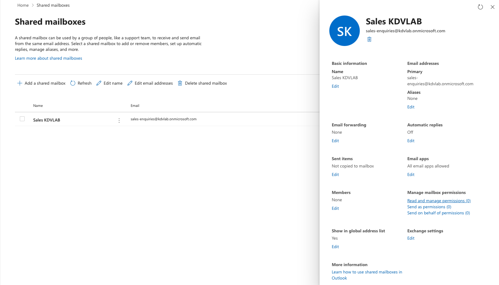
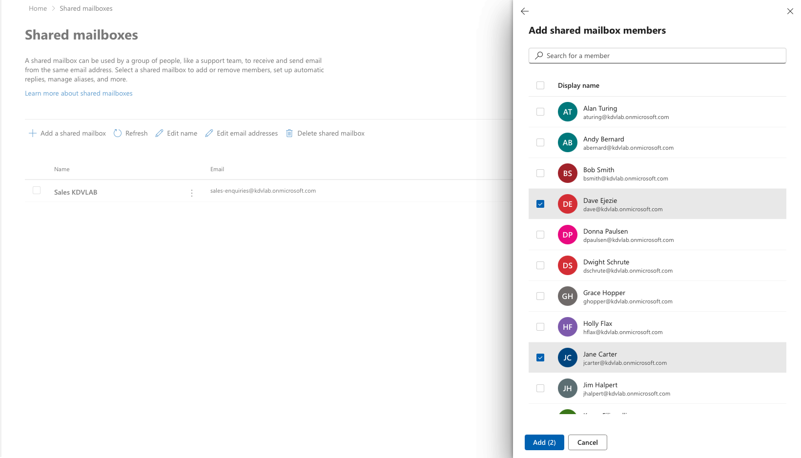
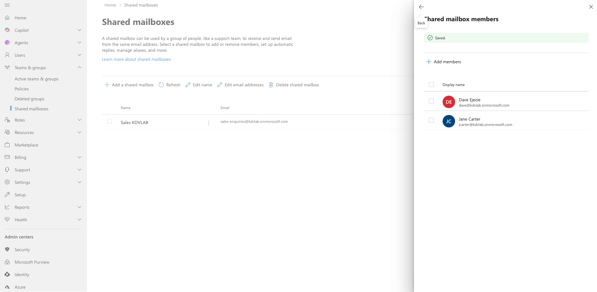

# 🔍 Activity: Lab 2.4 — Shared Mailboxes & Distribution Lists

| Field | Value |
|---|---|
| **Environment** | `helpdesk.lab` — M365 Admin Center / Exchange Online |
| **Tool Used** | Exchange Admin Center, Active Directory |
| **Status** | ✅ Complete |
| **Date** | 11 May 2026 |

---

## Objective
To provision a zero-cost Shared Mailbox for the Sales Department and grant access to multiple employees, navigating the architectural limitations of an on-premises Active Directory schema lacking Exchange extensions.

---

## ITIL Alignment & The "Why"
This activity fulfills a standard **Service Request**. In the Microsoft 365 ecosystem, licensing is a massive operational expense. Creating a standard User Account just to host a generic department email address (like `sales-enquiries@...`) wastes an E3/E5 license. 

By provisioning a **Shared Mailbox**, the business incurs zero licensing costs. Shared Mailboxes have no password and cannot be logged into directly, eliminating an attack vector. Access is granted purely via **Delegation (Read and Manage permissions)**, ensuring strict adherence to Role-Based Access Control (RBAC) and allowing multiple agents to collaborate in a single inbox.

---

## Execution: Provisioning the Shared Mailbox

### Step 1: Mailbox Creation
Navigated to the **Microsoft 365 Admin Center** -> **Teams & groups** -> **Shared mailboxes** and created a new mailbox.

> **Proof of Execution 1:** Initial configuration of the Sales Enquiries mailbox.
> 
> 

---

## Execution: Root Cause Analysis (The Hybrid Schema Wall)

When attempting to assign delegation rights using the on-premises synced security group (`GRP_Sales`), the group could not be found in the Exchange Online directory.

### Step 1: Investigating the Missing Group
Microsoft Exchange Online requires Mailbox Delegation to be assigned to a **Mail-Enabled Security Group (MESG)**. Because the local `DC01` server has never hosted an on-premises Exchange Server, the Active Directory Schema lacks crucial Exchange-specific attributes (such as `msExchRequireAuthToSendTo`). 

Consequently, even when manually injecting the `mail` and `proxyAddresses` attributes via ADUC's Attribute Editor on `DC01`, Azure AD Connect syncs the object as a standard `SecurityGroup` rather than a Mail-Enabled group, causing Exchange Online to filter it out of the delegation search. *(Note: This is an AD Schema limitation, not an issue with the group's Global/Universal scope).*

---

## Execution: Assigning Permissions (The Workaround)

To fulfill the Service Request without undertaking a massive AD Schema extension in a lab environment, the standard fallback method was utilized: direct user delegation.

### Step 1: Editing Permissions
The newly created mailbox properties were opened to modify the Read and Manage access lists.

> **Proof of Execution 2:** Accessing the mailbox properties post-creation.
> 
> 

### Step 2: Direct User Assignment
Searched for and explicitly assigned the individual Sales department members (`Jane Carter` and `Dave Ejezie`) to the mailbox.

> **Proof of Execution 3:** Searching and assigning individual synced users.
> 
> 

### Step 3: Verification
The users were successfully granted delegation rights. Within 60 minutes, the `Sales Enquiries` mailbox will automatically map and appear at the bottom of their respective Outlook applications via Microsoft's AutoMapping feature.

> **Proof of Execution 4:** Final verification of assigned members.
> 
> 

---

## Final Service Request Resolution Report

> **ServiceNow Request:** RITM0089221  
> **Category:** Email & Communication | **Subcategory:** Shared Mailboxes  
> **Priority:** P4 — Low (Standard Request)  
>   
> **Resolution Notes:**  
> Fulfilled request from the Sales Director to provision a collaborative team inbox. Created standard Shared Mailbox `sales-enquiries@kdvlab.onmicrosoft.com` to avoid unnecessary licensing costs. Identified an Active Directory Schema limitation preventing the use of on-premises security groups for delegation; applied standard workaround by explicitly delegating "Read and Manage" and "Send As" permissions directly to the required users (Jane Carter, Dave Ejezie). Informed users that the mailbox will AutoMap into their Outlook clients within 1 hour. Request closed.

---

## Related
- 🖥️ [Lab 2.1 - M365 Admin Centre Fundamentals](../01-M365-Admin-Centre/README.md)
