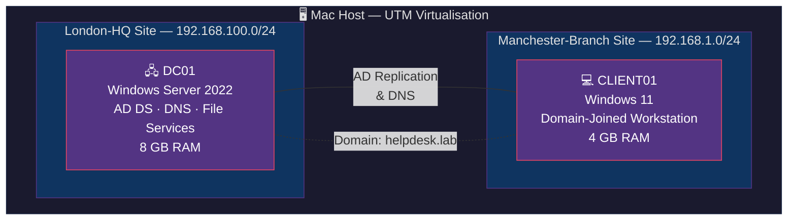

# 🖥️ Dave Ejezie — IT Support Homelab

> **Aspiring IT Support Analyst** based in London, building real-world help desk and sysadmin skills through a fully virtualised lab environment. Targeting MSP and IT support roles with hands-on experience in Active Directory, networking, ITIL-aligned incident management, and Microsoft 365 administration.

[](https://www.linkedin.com/in/dave-ejezie)
[](https://www.credly.com/badges/2b2096cf-ba6a-4a5f-8313-24684a7d549e/public_url)
[](https://learn.microsoft.com/api/credentials/share/en-gb/davest9496/7D55A4BFDCF4726?sharingId=8FEDAD1DD7CDEED9)
[](https://peoplecert.org)
[](https://www.comptia.org/certifications/network)

---

## 📋 Environment Overview

| VM | OS | Role | RAM | Disk | Architecture |
|----|-----|------|-----|------|-------------|
| **DC01** | Windows Server 2022 | Domain Controller · DNS Server · File Services | 8 GB | 65 GB | ARM64 |
| **CLIENT01** | Windows 11 | Domain-joined workstation | 4 GB | 66 GB | ARM64 |

| Setting | Value |
|---------|-------|
| **Virtualisation Platform** | UTM on macOS |
| **Domain** | `helpdesk.lab` |
| **NetBIOS Name** | `HELPDESK` |
| **Forest Functional Level** | Windows Server 2016 |
| **Domain Functional Level** | Windows Server 2016 |
| **AD Sites** | London-HQ (`192.168.100.0/24`) · Manchester-Branch (`192.168.1.0/24`) |

---

## 🗺️ Architecture Diagram



---

## 🔬 Lab Modules

| Module | Description | Status |
|--------|-------------|--------|
| [**AD-DS**](AD-DS/) | Domain controller setup, OU structure, security groups, AD Sites & Services | ✅ Phase 1 Complete |
| [**M365 & Google Workspace**](M365-Google-Workspace/) | M365 Admin Centre, Hybrid Identity Sync, Exchange Admin | 🚧 Phase 2 Active |
| **Ticketing Systems** | ServiceNow, Zendesk, Jira workflows and P1 simulation | 🔜 Phase 3 |
| **Windows Troubleshooting** | Event Viewer, Top common fixes, Quick Assist | 🔜 Phase 4 |
| **Network & Device Support** | DNS/DHCP break-fix, VPN config, Device Manager | 🔜 Phase 5 & 6 |

---

## 📚 Knowledge Base Articles

> Articles are added as each lab phase is completed.

| # | Article | Phase | Status |
|---|---------|-------|--------|
| KB-001 | [Account Lockout Procedure](kb-articles/account-lockout.md) | Phase 1 | ✅ Complete |
| KB-002 | [GPO Management Guide](kb-articles/gpo-management.md) | Phase 1 | ✅ Complete |
| KB-003 | [DHCP Troubleshooting](kb-articles/dhcp-troubleshooting.md) | Phase 5 | 🔜 Skeleton |
| KB-004 | [DNS Troubleshooting](kb-articles/dns-troubleshooting.md) | Phase 5 | 🔜 Skeleton |
| KB-005 | [P1 Major Incident Procedure](kb-articles/p1-major-incident.md) | Phase 3 | 🔜 Skeleton |
| KB-006 | [User Onboarding Procedure](kb-articles/onboarding.md) | Phase 1 | ✅ Complete |
| KB-007 | [User Offboarding Procedure](kb-articles/offboarding.md) | Phase 1 | 🔜 Skeleton |
| KB-008 | [DNS Domain Join Failure](kb-articles/dns-domain-join-failure.md) | Phase 1 | ✅ Complete |
| KB-009 | [Hyper-V Active Directory Lab Setup](kb-articles/hyper-v-lab-setup.md) | Phase 0 | ✅ Complete |

---

## 🎓 Certifications

| Certification | Provider | Status | Link |
|--------------|----------|--------|------|
| **CompTIA A+** | CompTIA | ✅ Passed | [Verify on Credly](https://www.credly.com/badges/2b2096cf-ba6a-4a5f-8313-24684a7d549e/public_url) |
| **MS-900** Microsoft 365 Fundamentals | Microsoft | ✅ Passed | [Verify on Microsoft Learn](https://learn.microsoft.com/api/credentials/share/en-gb/davest9496/7D55A4BFDCF4726?sharingId=8FEDAD1DD7CDEED9) |
| **ITIL 4 Foundation** | PeopleCert | ✅ Passed | — |
| **CompTIA Network+** | CompTIA | 🔄 In Progress | — |

---

## 🗂️ Repository Structure

```
home-lab/
├── README.md                         ← You are here
├── ROADMAP.md                        # Master competencies & phases checklist
├── AD-DS/                            # Phase 1: Local AD & Windows Server
│   ├── 01-Security-Groups/
│   ├── 02-User-Creation/
│   ├── 03-Group-Policies/
│   ├── 04-Domain-Join/
│   ├── 05-Windows-Admin-Center/
│   ├── 06-Account-Lockouts/
│   └── 07-Delegation-Least-Privilege/
├── M365-Google-Workspace/            # Phase 2: Cloud Admin & Hybrid Identity
│   ├── 01-M365-Admin-Centre/
│   ├── 02-Hybrid-AD-Connect/
│   ├── 03-MFA-Reset/
│   └── ...
├── helpdesk-scripts/                 # PowerShell helpdesk tools
├── rebuild-scripts/                  # Infrastructure and bulk user automation
└── kb-articles/                      # Helpdesk Knowledge Base articles
    ├── account-lockout.md
    ├── dns-domain-join-failure.md
    ├── hyper-v-lab-setup.md
    └── ...
```

---

*Last updated: 20 March 2026*
