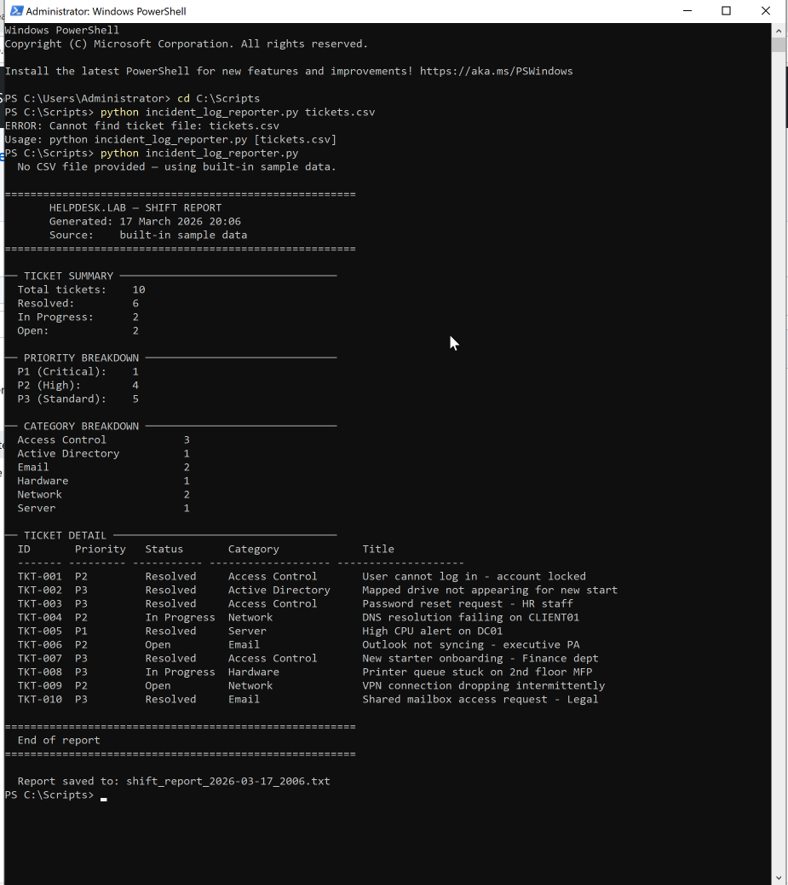

# helpdesk-scripts

PowerShell and Python scripts for common IT Helpdesk tasks.
Built and tested in a Windows Server 2022 / Active Directory homelab (UTM on macOS).

---

## Scripts

| Script | Language | Purpose |
|--------|----------|---------|
| `active-directory/onboard-user.ps1` | PowerShell | Create AD user, assign to OU and security groups, set temp password, log actions |
| `active-directory/offboard-user.ps1` | PowerShell | Disable account, strip group memberships, move to Disabled OU, update description for audit trail |
| `system-maintenance/system-health-check.py` | Python | Check CPU, memory, disk, and network connectivity — human-readable or JSON output |
| `incident-log-reporter/incident_log_reporter.py` | Python | Parse helpdesk incident CSVs and generate summary reports by category, priority, and resolution time |

---

## Requirements

**PowerShell scripts**
- Windows Server 2022 with Active Directory Domain Services (AD DS) installed
- ActiveDirectory PowerShell module (included on domain controllers; install via RSAT on workstations)
- Run as a user with appropriate AD permissions

**Python script**
- Python 3.8+
- `pip install psutil`
- Works on Windows, Linux, and macOS

---

## Usage

### Onboard a new user

```powershell
# Basic — creates user in Finance OU
.\active-directory\onboard-user.ps1 -FirstName "Jane" -LastName "Smith" -Department "Finance"

# With job title and manager
.\active-directory\onboard-user.ps1 -FirstName "Tom" -LastName "Hughes" -Department "IT" -JobTitle "Support Analyst" -Manager "jbrown"
```

The script will:
1. Generate a SAMAccountName (first initial + surname)
2. Verify the department OU exists before proceeding
3. Create the user with a temporary password (`Welcome123!` — change in script config)
4. Add to departmental security group (`GRP_<Department>`) and `GRP_AllStaff`
5. Log all actions to `C:\Logs\Helpdesk\onboarding_YYYY-MM-DD.log`

### Offboard a leaver

```powershell
# With ticket reference (recommended for audit trail)
.\active-directory\offboard-user.ps1 -SAMAccountName "jsmith" -TicketNumber "INC0001234"

# Without ticket reference
.\active-directory\offboard-user.ps1 -SAMAccountName "abrown"
```

The script will:
1. Disable the account
2. Remove all group memberships
3. Clear the manager field
4. Update the account description with offboarding date and ticket reference
5. Move the account to `OU=Disabled`
6. Log all actions to `C:\Logs\Helpdesk\offboarding_YYYY-MM-DD.log`

> **Note:** The account is not deleted. Retain for your organisation's data retention period (typically 30 days) before permanent deletion.

### System health check

```bash
# Human-readable report
python3 system-maintenance/system-health-check.py

# JSON output (for logging or piping to other tools)
python3 system-maintenance/system-health-check.py --json

# Custom hosts and disk paths
python3 system-maintenance/system-health-check.py --hosts 8.8.8.8 192.168.1.1 --disk / /mnt/data
```

Sample output:

```
====================================================================
  SYSTEM HEALTH CHECK — 2026-02-24 14:32:01
  Host: SRV-UBUNTU  |  Linux 5.15.0  |  Up: 48.3 hours
====================================================================
  [  OK  ]  CPU Usage: 12%
             4 logical cores @ 2.4 GHz
  [  OK  ]  Memory Usage: 61%
             2.4GB used / 4.0GB total  |  1.6GB available
  [ WARN ]  Disk (/): 78%
             31.2GB used / 40.0GB total  |  8.8GB free
  [  OK  ]  Network Connectivity: OK
             ✓ 8.8.8.8 — REACHABLE
             ✓ 1.1.1.1 — REACHABLE
====================================================================
  OVERALL STATUS: ATTENTION REQUIRED
====================================================================
```

### Incident log reporter

```bash
python3 incident-log-reporter/incident_log_reporter.py
```

The script parses helpdesk incident CSV logs and generates shift reports summarising daily ticket activity — broken down by priority (P1/P2/P3), category, and status.

<details>
<summary>📸 Sample shift report output</summary>



</details>

---

## Homelab Environment

These scripts were developed and tested in:

- **DC01** — Windows Server 2022 (Domain Controller: AD DS, DNS, DHCP)
- **CLIENT01** — Windows 11 (domain-joined client)
- **SRV-UBUNTU** — Ubuntu Server 22.04 (osTicket, monitoring)
- **Host** — macOS + UTM (VM hypervisor)

Domain: `helpdesk.lab` (local lab domain, not production)

---

## Background

These scripts automate the most common Tier 1 helpdesk tasks.
They exist because repetitive tasks are the biggest time sink in IT Support — and because scripting them demonstrates something more useful than just knowing the GUI.

---

*Part of my [IT Support homelab project](../README.md). See also: [kb-articles](../kb-articles).*
