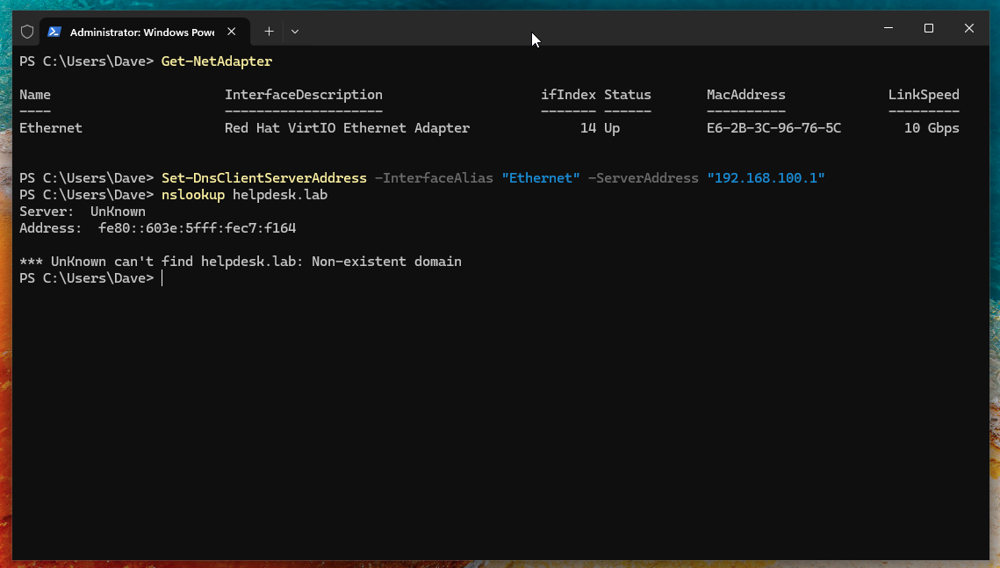
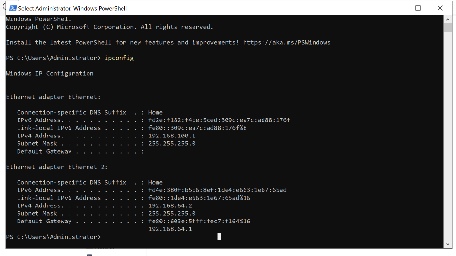
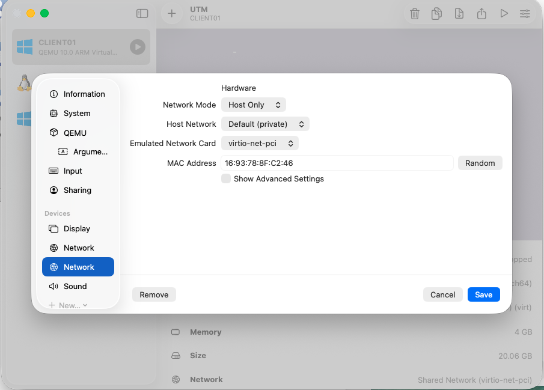
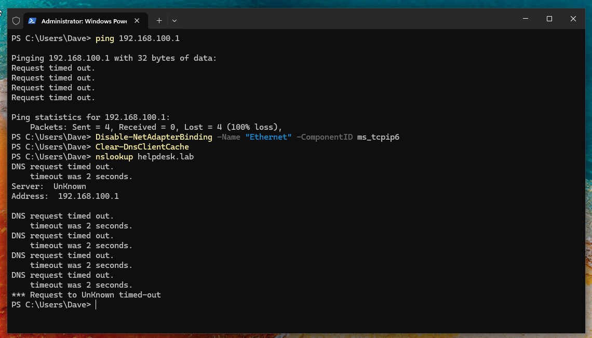
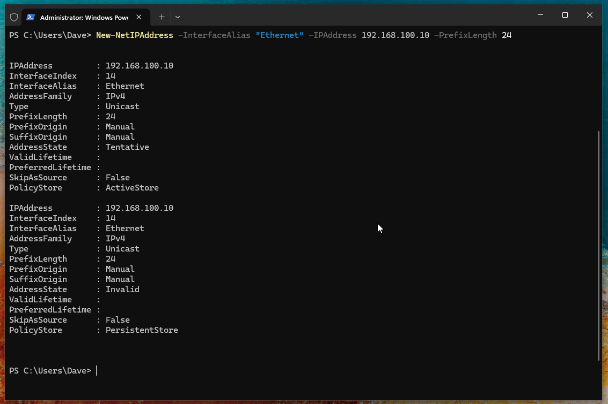
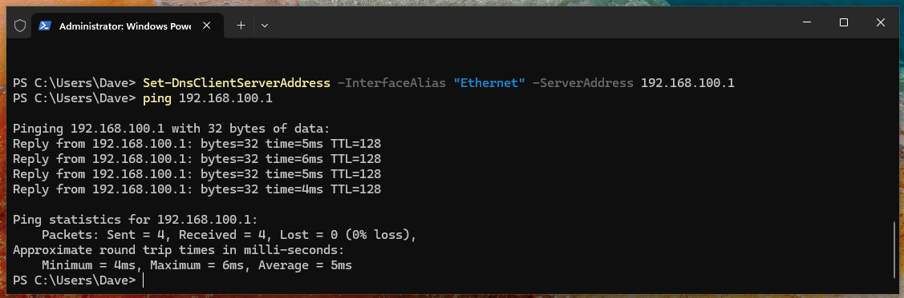
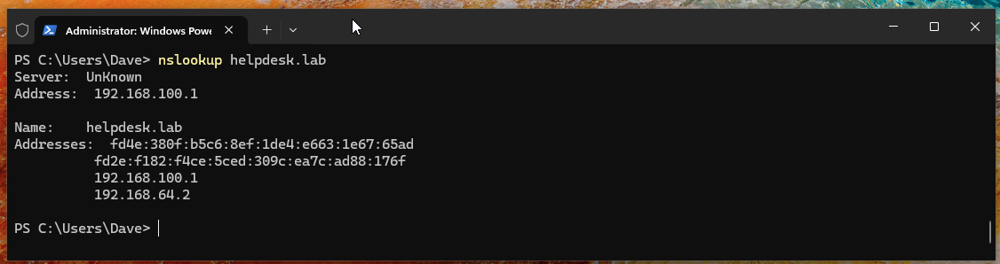

# KB-008: DNS Domain Join Failure (IPv6 & Routing Conflict)

| Field | Value |
|-------|-------|
| **Category** | Virtualisation / Network |
| **Priority** | P2 — High |
| **Applies To** | UTM Virtual Machines, Domain Clients |
| **Last Updated** | <!-- Date --> |

## Symptoms

- Trying to join a client VM (`CLIENT01`) to the `helpdesk.lab` domain fails.
- Running `nslookup helpdesk.lab` returns `Non-existent domain` and shows the server is an IPv6 address (`fe80::...`) instead of the expected Domain Controller's IPv4 address.
  
- Even after running `Set-DnsClientServerAddress`, the system still fails to resolve the domain.

## Cause

In this virtualization environment (UTM), the VMs may be dealing with multiple network interfaces or IPv6 prioritization:
1. **Network Adapter Mismatch:** `DC01` typically has two network interfaces (one for internal lab traffic like `192.168.100.x` and one for the Shared Network/Internet like `192.168.64.x`). If `CLIENT01` is only connected to the Shared Network, it cannot route traffic to `192.168.100.1` on the internal network.
2. **IPv6 DNS Leakage:** The default UTM gateway provides an IPv6 DNS server via Router Advertisement. If `CLIENT01` fails to reach the IPv4 DNS server, or if IPv6 takes precedence, Windows will send DNS queries to the IPv6 gateway (which knows nothing about the `.lab` domain) and returns a hard failure.

## Resolution Steps

### Phase 1: Verify Adapter Networking in UTM
Before running OS commands, ensure the VMs can physically talk to each other:
1. Verify `DC01` has a static IPv4 address assigned to its internal adapter:
   
2. Ensure both `DC01` and `CLIENT01` have a network adapter assigned to the **same internal network** (e.g., VLAN or Host-Only) in UTM.
3. If `CLIENT01` only has one adapter and it's set to "Shared Network", add a second adapter in UTM set to the same internal network as the DC, or edit the existing one.



### Phase 2: Disable IPv6 for the Lab Adapter
To force Windows to use the IPv4 Domain Controller for DNS, disable IPv6 on the client's internal network adapter:
1. Open PowerShell as Administrator on `CLIENT01`.
2. Disable the IPv6 binding on the adapter:
   ```powershell
   Disable-NetAdapterBinding -Name "Ethernet" -ComponentID ms_tcpip6
   ```



### Phase 3: Set and Verify IPv4 DNS
1. Ensure the IPv4 DNS is pointing exclusively to the Domain Controller. If your machine fell back to APIPA, assign a static IP first:
   ```powershell
   New-NetIPAddress -InterfaceAlias "Ethernet" -IPAddress 192.168.100.10 -PrefixLength 24
   Set-DnsClientServerAddress -InterfaceAlias "Ethernet" -ServerAddress "192.168.100.1"
   ```



2. Flush the DNS cache:
   ```powershell
   Clear-DnsClientCache
   ```
3. Test connectivity and name resolution:
   ```powershell
   # 1. Test basic IP routing to ensure the VMs can talk
   ping 192.168.100.1
   
   # 2. Test DNS resolution
   nslookup helpdesk.lab
   ```



### Phase 4: Joining the Domain
Once `nslookup` successfully returns `192.168.100.1`:
1. Execute the domain join:
   ```powershell
   Add-Computer -DomainName "helpdesk.lab" -Credential (Get-Credential) -Restart
   ```
2. Log into the Client VM using domain credentials (e.g., `HELPDESK\Administrator`).

## Prevention
- Standardise adapter configurations in UTM: Adapter 1 for Shared Network (internet), Adapter 2 for Internal Lab (VLAN).
- Disable IPv6 on internal domain networks where it is not explicitly configured or managed by Active Directory.

## Related
- KB-004: DNS Troubleshooting Guide
